# Data Sufficiency

<h3>1- Is zw positive?</h3>

(1) $z + w^3 = 20$

(2) $z$ is positive

[explanation](./amat_answer_explanation.md#Q1)

<fieldset> 

  

    (A) Statement (1) ALONE is sufficient, but Statement (2) alone is not sufficient.
  

  

    (B) Statement (2) ALONE is sufficient, but Statement (1) alone is not sufficient.
  

  

    (C) Both statements TOGHTHER are sufficient, but NIGHTHER statements ALONE is sufficient.
  

  

    (D) EACH statement ALONE is sufficient.
  

  

    <mark>(E) Statement (1) and (2) TOGHTHER are NOT sufficient.✔    </mark>
  

</fieldset>

----

<h3>2- Some computers at a certain company are Brand X and the rest are Brand Y. If the ratio of the
number of Brand Y computers to the number of Brand X computers at the company is 5 to 6,
how many of the computers are Brand Y?</h3>

(1) There are 80 more Brand X computers than Brand Y computers at the company.

(2) There is a total of 880 computers at the company.

[explanation](./amat_answer_explanation.md#Q2)

<fieldset> 

  

    (A) Statement (1) ALONE is sufficient, but Statement (2) alone is not sufficient.
  

  

    (B) Statement (2) ALONE is sufficient, but Statement (1) alone is not sufficient.
  

  

    (C) Both statements TOGHTHER are sufficient, but NIGHTHER statements ALONE is sufficient.
  

  

  <mark>
    (D) EACH statement ALONE is sufficient.
  ✔    </mark>
  

  

    (E) Statement (1) and (2) TOGHTHER are NOT sufficient.
  

  
</fieldset>

----

<h3>3- If Ann saves x dollars each week and Beth saves y dollars each week, what is the total amount
that they save per week?</h3>

(1) Beth saves $5 more per week than Ann saves per week.

(2) It takes Ann 6 weeks to save the same amount that Beth saves in 5 weeks

[explanation](./amat_answer_explanation.md#Q3)

<fieldset> 

  

    (A) Statement (1) ALONE is sufficient, but Statement (2) alone is not sufficient.
  

  

    (B) Statement (2) ALONE is sufficient, but Statement (1) alone is not sufficient.
  

  

  <mark>
    (C) Both statements TOGHTHER are sufficient, but NIGHTHER statements ALONE is sufficient.
  ✔    </mark>
  

  

    (D) EACH statement ALONE is sufficient.
  

  

    (E) Statement (1) and (2) TOGHTHER are NOT sufficient.
  

  
</fieldset>

----

<h3>4- If the total price of n equally priced shares of a certain stock was $12,000, what was the price
per share of the stock?</h3>

(1) If the price per share of the stock had been $1 more, the total price of the n shares would
have been $300 more.

(2) If the price per share of the stock had been $2 less, the total price of the n shares would have
been 5 percent less.

[explanation](./amat_answer_explanation.md#Q4)

<fieldset> 

  

    (A) Statement (1) ALONE is sufficient, but Statement (2) alone is not sufficient.
  

  

    (B) Statement (2) ALONE is sufficient, but Statement (1) alone is not sufficient.
  

  

    (C) Both statements TOGHTHER are sufficient, but NIGHTHER statements ALONE is sufficient.
  

  

    <mark>
    (D) EACH statement ALONE is sufficient.
    ✔    </mark>
  

  

    (E) Statement (1) and (2) TOGHTHER are NOT sufficient.
  

  
</fieldset>

----

<h3>5- The total cost of an office dinner was shared equally by k of the n employees who attended the
dinner. What was the total cost of the dinner?</h3>

(1) Each of the k employees who shared the cost of the dinner paid $19.

(2) If the total cost of the dinner had been shared equally by k +1 of the n employees who
attended the dinner, each of the k +1 employees would have paid $18.

[explanation](./amat_answer_explanation.md#Q5)

----

<fieldset> 

  

    (A) Statement (1) ALONE is sufficient, but Statement (2) alone is not sufficient.
  

  

    (B) Statement (2) ALONE is sufficient, but Statement (1) alone is not sufficient.
  

  

    <mark>
    (C) Both statements TOGHTHER are sufficient, but NIGHTHER statements ALONE is sufficient.
    ✔    </mark>
  

  

    (D) EACH statement ALONE is sufficient.
  

  

    (E) Statement (1) and (2) TOGHTHER are NOT sufficient.
  

  
</fieldset>

----

<h3>6- If x and y are integers, what is the value of y ?</h3>

(1) $xy = 27$

(2) $x = y^2$

[explanation](./amat_answer_explanation.md#Q6)

<fieldset> 

  

    (A) Statement (1) ALONE is sufficient, but Statement (2) alone is not sufficient.
  

  

    (B) Statement (2) ALONE is sufficient, but Statement (1) alone is not sufficient.
  

  

    <mark>
    (C) Both statements TOGHTHER are sufficient, but NIGHTHER statements ALONE is sufficient.
    ✔    </mark>
  

  

    (D) EACH statement ALONE is sufficient.
  

  

    (E) Statement (1) and (2) TOGHTHER are NOT sufficient.
  

  
</fieldset>

----

<h3>7- What is the average (arithmetic mean) of x and y?</h3>

(1) The average of $x$ and $2y$ is 10.

(2) The average of $2x$ and $7y$ is 32.

[explanation](./amat_answer_explanation.md#Q7)

<fieldset> 

  

    (A) Statement (1) ALONE is sufficient, but Statement (2) alone is not sufficient.
  

  

    (B) Statement (2) ALONE is sufficient, but Statement (1) alone is not sufficient.
  

  

    <mark>
    (C) Both statements TOGHTHER are sufficient, but NIGHTHER statements ALONE is sufficient.
    ✔    </mark>
  

  

    (D) EACH statement ALONE is sufficient.
  

  

    (E) Statement (1) and (2) TOGHTHER are NOT sufficient.
  

  
</fieldset>

----

<h3>8- What was the amount of money donated to a certain charity?</h3>

(1) Of the amount donated, 40 percent came from corporate donations.

(2) Of the amount donated, $1.5 million came from noncorporate donations.

[explanation](./amat_answer_explanation.md#Q8)

<fieldset> 

  

    (A) Statement (1) ALONE is sufficient, but Statement (2) alone is not sufficient.
  

  

    (B) Statement (2) ALONE is sufficient, but Statement (1) alone is not sufficient.
  

  

    <mark>
    (C) Both statements TOGHTHER are sufficient, but NIGHTHER statements ALONE is sufficient.
    ✔    </mark>
  

  

    (D) EACH statement ALONE is sufficient.
  

  

    (E) Statement (1) and (2) TOGHTHER are NOT sufficient.
  

  
</fieldset>

----

<h3>9- What is the sum of the first four terms of sequence S?</h3>

(1) After the first two terms of $S$,the value of each term of $S$ is equal to the average (arithmetic
mean) of the last two preceding terms.

(2) The average (arithmetic mean) of the first three terms of $S$ is 10.

[explanation](./amat_answer_explanation.md#Q9)

<fieldset> 

  

    (A) Statement (1) ALONE is sufficient, but Statement (2) alone is not sufficient.
  

  

    (B) Statement (2) ALONE is sufficient, but Statement (1) alone is not sufficient.
  

  

    (C) Both statements TOGHTHER are sufficient, but NIGHTHER statements ALONE is sufficient.
  

  

    (D) EACH statement ALONE is sufficient.
  

  

    <mark>
    (E) Statement (1) and (2) TOGHTHER are NOT sufficient.
    ✔    </mark>
  

  
</fieldset>

----

<h3>10- What is the value of the integer N?</h3>

(1) $101 < N < 103$

(2) $202 < 2N < 206$

[explanation](./amat_answer_explanation.md#Q10)
<fieldset> 

  

    (A) Statement (1) ALONE is sufficient, but Statement (2) alone is not sufficient.
  

  

    (B) Statement (2) ALONE is sufficient, but Statement (1) alone is not sufficient.
  

  

    (C) Both statements TOGHTHER are sufficient, but NIGHTHER statements ALONE is sufficient.
  

  

    <mark>
    (D) EACH statement ALONE is sufficient.
    ✔    </mark>
  

  

    (E) Statement (1) and (2) TOGHTHER are NOT sufficient.
  

  
</fieldset>

----

<h3>11- Is the median of the five numbers a, b, c, d and e equal to d?</h3>

(1) $a < c < e$

(2) $b < d < c$

[explanation](./amat_answer_explanation.md#Q11)

<fieldset> 

  

    (A) Statement (1) ALONE is sufficient, but Statement (2) alone is not sufficient.
  

  

    (B) Statement (2) ALONE is sufficient, but Statement (1) alone is not sufficient.
  

  

    (C) Both statements TOGHTHER are sufficient, but NIGHTHER statements ALONE is sufficient.
  

  

    (D) EACH statement ALONE is sufficient.
  

  

    <mark>
    (E) Statement (1) and (2) TOGHTHER are NOT sufficient.
    ✔    </mark>
  

  
</fieldset>

----

<h3>12- If n is an integer, then n is divisible by how many positive integers?</h3>

(1) $n$ is the product of two different prime numbers.

(2) $n$ and $2^3$ are each divisible by the same number of positive integers.

[explanation](./amat_answer_explanation.md#Q12)

<fieldset> 

  

    (A) Statement (1) ALONE is sufficient, but Statement (2) alone is not sufficient.
  

  

    (B) Statement (2) ALONE is sufficient, but Statement (1) alone is not sufficient.
  

  

    (C) Both statements TOGHTHER are sufficient, but NIGHTHER statements ALONE is sufficient.
  

  

    <mark>
    (D) EACH statement ALONE is sufficient.
    ✔    </mark>
  

  

    (E) Statement (1) and (2) TOGHTHER are NOT sufficient.
  

  
</fieldset>

----

<h3>13- If x, y, and z are numbers, is z = 18 ?</h3>

(1) The average (arithmetic mean) of $x$, $y$, and $z$ is 6.

(2) $x = -y$

[explanation](./amat_answer_explanation.md#Q13)

<fieldset> 

  

    (A) Statement (1) ALONE is sufficient, but Statement (2) alone is not sufficient.
  

  

    (B) Statement (2) ALONE is sufficient, but Statement (1) alone is not sufficient.
  

  

    <mark>
    (C) Both statements TOGHTHER are sufficient, but NIGHTHER statements ALONE is sufficient.
    ✔    </mark>
  

  

    (D) EACH statement ALONE is sufficient.
  

  

    (E) Statement (1) and (2) TOGHTHER are NOT sufficient.
  

  
</fieldset>

----

<h3>14- Elena receives a salary plus a commission that is equal to a fixed percentage of her sales
revenue. What was the total of Elena's salary and commission last month?</h3>

(1) Elena's monthly salary is $1 ,000.

(2) Elena's commission is 5 percent of her sales revenue.

[explanation](./amat_answer_explanation.md#Q14)

<fieldset> 

  

    (A) Statement (1) ALONE is sufficient, but Statement (2) alone is not sufficient.
  

  

    (B) Statement (2) ALONE is sufficient, but Statement (1) alone is not sufficient.
  

  

    (C) Both statements TOGHTHER are sufficient, but NIGHTHER statements ALONE is sufficient.
  

  

    (D) EACH statement ALONE is sufficient.
  

  

    <mark>
    (E) Statement (1) and (2) TOGHTHER are NOT sufficient.
    ✔    </mark>
  

  
</fieldset>

----

<h3>15- If the set S consists of five consecutive positive integers, what is the sum of these five integers?</h3>

(1) The integer 11 is in $S$, but 10 is not in $S$

(2) The sum of the even integers in $S$ is 26

[explanation](./amat_answer_explanation.md#Q15)
<fieldset> 

  

    (A) Statement (1) ALONE is sufficient, but Statement (2) alone is not sufficient.
  

  

    (B) Statement (2) ALONE is sufficient, but Statement (1) alone is not sufficient.
  

  

    (C) Both statements TOGHTHER are sufficient, but NIGHTHER statements ALONE is sufficient.
  

  

    <mark>
    (D) EACH statement ALONE is sufficient.
    ✔    </mark>
  

  

    (E) Statement (1) and (2) TOGHTHER are NOT sufficient.
  

  
</fieldset>

----

<h3>16- Is the volume of cube A greater than the volume of cube B?</h3>

1) The volume of cube $A$ is 160 percent of the volume of cube $B$.

2) The volume of cube $B$ is 62.5 percent of the volume of cube $A$.

[explanation](./amat_answer_explanation.md#Q16)

<fieldset> 

  

    (A) Statement (1) ALONE is sufficient, but Statement (2) alone is not sufficient.
  

  

    (B) Statement (2) ALONE is sufficient, but Statement (1) alone is not sufficient.
  

  

    (C) Both statements TOGHTHER are sufficient, but NIGHTHER statements ALONE is sufficient.
  

  

    <mark>
    (D) EACH statement ALONE is sufficient.
    ✔    </mark>
  

  

    (E) Statement (1) and (2) TOGHTHER are NOT sufficient.
  

  
</fieldset>

----

<h3>17- What is the value of m if m = 4c / 5d and d is not equal to zero?</h3>

1) $c = 10d$

2) $c = 2$

[explanation](./amat_answer_explanation.md#Q17)

<fieldset> 
  

    <mark>
    (A) Statement (1) ALONE is sufficient, but Statement (2) alone is not sufficient.
    ✔    </mark>
  

  

    (B) Statement (2) ALONE is sufficient, but Statement (1) alone is not sufficient.
  

  

    (C) Both statements TOGHTHER are sufficient, but NIGHTHER statements ALONE is sufficient.
  

  

    (D) EACH statement ALONE is sufficient.
  

  

    (E) Statement (1) and (2) TOGHTHER are NOT sufficient.
  

  
</fieldset>

----

<h3>18- What is the value of 2x - y?</h3>

1) $x + y = 12$
2) $x - y = 4$

[explanation](./amat_answer_explanation.md#Q18)

<fieldset> 

  

    (A) Statement (1) ALONE is sufficient, but Statement (2) alone is not sufficient.
  

  

    (B) Statement (2) ALONE is sufficient, but Statement (1) alone is not sufficient.
  

  

    <mark>
    (C) Both statements TOGHTHER are sufficient, but NIGHTHER statements ALONE is sufficient.
    ✔    </mark>
  

  

    (D) EACH statement ALONE is sufficient.
  

  

    (E) Statement (1) and (2) TOGHTHER are NOT sufficient.
  

  
</fieldset>

----

<h3>19- What is the ratio of c to d?</h3>

(1) The ratio of $3c$ to $3d$ is 3 to 4.

(2) The ratio of $c + 3$ to $d +3$ is 4 to 5.

[explanation](./amat_answer_explanation.md#Q19)

<fieldset> 

  

    <mark>
    (A) Statement (1) ALONE is sufficient, but Statement (2) alone is not sufficient.
    ✔    </mark>
  

  

    (B) Statement (2) ALONE is sufficient, but Statement (1) alone is not sufficient.
  

  

    (C) Both statements TOGHTHER are sufficient, but NIGHTHER statements ALONE is sufficient.
  

  

    (D) EACH statement ALONE is sufficient.
  

  

    (E) Statement (1) and (2) TOGHTHER are NOT sufficient.
  

  
</fieldset>

----

<h3>20- What is the value of x?</h3>

(1) $x + 1 = 2 - 3x$

(2) $1/(2x) = 2$

[explanation](./amat_answer_explanation.md#Q20)

<fieldset> 

  

    (A) Statement (1) ALONE is sufficient, but Statement (2) alone is not sufficient.
  

  

    (B) Statement (2) ALONE is sufficient, but Statement (1) alone is not sufficient.
  

  

    (C) Both statements TOGHTHER are sufficient, but NIGHTHER statements ALONE is sufficient.
  

  

    <mark>
    (D) EACH statement ALONE is sufficient.
    ✔    </mark>
  

  

    (E) Statement (1) and (2) TOGHTHER are NOT sufficient.
  

  
</fieldset>

----

<h3>21- Which of the positive numbers x or y is greater?</h3>

(1) $y = 2x$

(2) $2x + 5y = 12$

[explanation](./amat_answer_explanation.md#Q21)

<fieldset> 

  

    <mark>
    (A) Statement (1) ALONE is sufficient, but Statement (2) alone is not sufficient.
    ✔    </mark>
  

  

    (B) Statement (2) ALONE is sufficient, but Statement (1) alone is not sufficient.
  

  

    (C) Both statements TOGHTHER are sufficient, but NIGHTHER statements ALONE is sufficient.
  

  

    (D) EACH statement ALONE is sufficient.
  

  

    (E) Statement (1) and (2) TOGHTHER are NOT sufficient.
  

  
</fieldset>

----

<h3>22- For all x, the expression x* is defined to be ax+ a, where a is a constant. What is the value
of 2*?</h3>

(1) $3*=2$

(2) $5*=3$

[explanation](./amat_answer_explanation.md#Q22)

<fieldset> 

  

    (A) Statement (1) ALONE is sufficient, but Statement (2) alone is not sufficient.
  

  

    (B) Statement (2) ALONE is sufficient, but Statement (1) alone is not sufficient.
  

  

    (C) Both statements TOGHTHER are sufficient, but NIGHTHER statements ALONE is sufficient.
  

  

    <mark>
    (D) EACH statement ALONE is sufficient.
    ✔    </mark>
  

  

    (E) Statement (1) and (2) TOGHTHER are NOT sufficient.
  

  
</fieldset>

----

<h3>23- If x² + y² = 29, what is the value of (x - y)²?</h3>

(1) $xy = 10$

(2) $x = 5$

[explanation](./amat_answer_explanation.md#Q23)

<fieldset> 

  

    <mark>
    (A) Statement (1) ALONE is sufficient, but Statement (2) alone is not sufficient.
    ✔    </mark>
  

  

    (B) Statement (2) ALONE is sufficient, but Statement (1) alone is not sufficient.
  

  

    (C) Both statements TOGHTHER are sufficient, but NIGHTHER statements ALONE is sufficient.
  

  

    (D) EACH statement ALONE is sufficient.
  

  

    (E) Statement (1) and (2) TOGHTHER are NOT sufficient.
  

  
</fieldset>

----

<h3>24- Is 2x > 2y?</h3>

(1) $x > y$

(2) $3x > 3y$

[explanation](./amat_answer_explanation.md#Q24)

<fieldset> 

  

    (A) Statement (1) ALONE is sufficient, but Statement (2) alone is not sufficient.
  

  

    (B) Statement (2) ALONE is sufficient, but Statement (1) alone is not sufficient.
  

  

    (C) Both statements TOGHTHER are sufficient, but NIGHTHER statements ALONE is sufficient.
  

  

    <mark>
    (D) EACH statement ALONE is sufficient.
    ✔    </mark>
  

  

    (E) Statement (1) and (2) TOGHTHER are NOT sufficient.
  

  
</fieldset>

----

<h3>25- Rita's monthly salary is 2/3 Juanita's monthly salary. What is their combined monthly salary?</h3>

(1) Rita's monthly salary is $ 4,000.

(2) Either Rita's monthly salary or Juanita's monthly salary is $ 6,000.

[explanation](./amat_answer_explanation.md#Q25)

<fieldset> 

  

    <mark>
    (A) Statement (1) ALONE is sufficient, but Statement (2) alone is not sufficient.
    ✔    </mark>
  

  

    (B) Statement (2) ALONE is sufficient, but Statement (1) alone is not sufficient.
  

  

    (C) Both statements TOGHTHER are sufficient, but NIGHTHER statements ALONE is sufficient.
  

  

    (D) EACH statement ALONE is sufficient.
  

  

    (E) Statement (1) and (2) TOGHTHER are NOT sufficient.
  

  
</fieldset>

----

<h3>26- A certain dealership has a number of cars to be sold by its salespeople. How many cars are to
be sold?</h3>

(1) If each of the salespeople sells 4 of the cars, 23 cars will remain unsold.

(2) If each of the salespeople sells 6 of the cars, 5 cars will remain unsold.

[explanation](./amat_answer_explanation.md#Q26)

<fieldset> 

  

    (A) Statement (1) ALONE is sufficient, but Statement (2) alone is not sufficient.
  

  

    (B) Statement (2) ALONE is sufficient, but Statement (1) alone is not sufficient.
  

  

    <mark>
    (C) Both statements TOGHTHER are sufficient, but NIGHTHER statements ALONE is sufficient.
    ✔    </mark>
  

  

    (D) EACH statement ALONE is sufficient.
  

  

    (E) Statement (1) and (2) TOGHTHER are NOT sufficient.
  

  
</fieldset>

----

<h3>27- If x is a positive integer, what is the value of x ?</h3>

  (1) $x^2=√x$

  (2) $n/x = n$ and $n ≠ 0$

[explanation](./amat_answer_explanation.md#Q27)

<fieldset> 

  

    (A) Statement (1) ALONE is sufficient, but Statement (2) alone is not sufficient.
  

  

    (B) Statement (2) ALONE is sufficient, but Statement (1) alone is not sufficient.
  

  

    (C) Both statements TOGHTHER are sufficient, but NIGHTHER statements ALONE is sufficient.
  

  

    <mark>
    (D) EACH statement ALONE is sufficient.
    ✔    </mark>
  

  

    (E) Statement (1) and (2) TOGHTHER are NOT sufficient.
  

  
</fieldset>

----

<h3>28-How many hours would it take Pump A and Pump B working together, each at its own constant
rate, to empty a tank that was initially full?</h3>

(1) Working alone at its constant rate, Pump A would empty the full tank in 4 hours 20 minutes.

(2) Working alone, Pump B would empty the full tank at its constant rate of 72 liters per minute.

[explanation](./amat_answer_explanation.md#Q28)

<fieldset> 

  

    (A) Statement (1) ALONE is sufficient, but Statement (2) alone is not sufficient.
  

  

    (B) Statement (2) ALONE is sufficient, but Statement (1) alone is not sufficient.
  

  

    (C) Both statements TOGHTHER are sufficient, but NIGHTHER statements ALONE is sufficient.
  

  

    (D) EACH statement ALONE is sufficient.
  

  

    <mark>
    (E) Statement (1) and (2) TOGHTHER are NOT sufficient.
    ✔    </mark>
  

  
</fieldset>

----

<h3>29- What is the area of rectangular region R?</h3>

(1) Each diagonal of $R$ has length 5.

(2) The perimeter of $R$ is 14.

[explanation](./amat_answer_explanation.md#Q29)

<fieldset> 

  

    (A) Statement (1) ALONE is sufficient, but Statement (2) alone is not sufficient.
  

  

    (B) Statement (2) ALONE is sufficient, but Statement (1) alone is not sufficient.
  

  

    <mark>
    (C) Both statements TOGHTHER are sufficient, but NIGHTHER statements ALONE is sufficient.
    ✔    </mark>
  

  

    (D) EACH statement ALONE is sufficient.
  

  

    (E) Statement (1) and (2) TOGHTHER are NOT sufficient.
  

  
</fieldset>

----

<h3>30- A tank containing water started to leak. Did the tank contain more than 30 gallons of water
when it started to leak? (Note: 1 gallon = 128 ounces)</h3>

(1) The water leaked from the tank at a constant rate of 6.4 ounces per minute.

(2) The tank became empty less than 12 hours after it started to leak.

[explanation](./amat_answer_explanation.md#Q30)

<fieldset> 

  

    (A) Statement (1) ALONE is sufficient, but Statement (2) alone is not sufficient.
  

  

    (B) Statement (2) ALONE is sufficient, but Statement (1) alone is not sufficient.
  

  

    (C) Both statements TOGHTHER are sufficient, but NIGHTHER statements ALONE is sufficient.
  

  

    (D) EACH statement ALONE is sufficient.
  

  

    <mark>
    (E) Statement (1) and (2) TOGHTHER are NOT sufficient.
    ✔    </mark>
  

  
</fieldset>

----

<h3>31- During a certain bicycle ride, was Sherry's average speed faster than 24 kilometers per hour? (1
kilometer = 1000 meter)</h3>

(1) Sherry's average speed during the bicycle ride was faster than 7 meters per second.

(2) Sherry's average speed during the bicycle ride was slower than 8 meters per second.

[explanation](./amat_answer_explanation.md#Q31)

<fieldset> 

  

    <mark>
    (A) Statement (1) ALONE is sufficient, but Statement (2) alone is not sufficient.
    ✔    </mark>
  

  

    (B) Statement (2) ALONE is sufficient, but Statement (1) alone is not sufficient.
  

  

    (C) Both statements TOGHTHER are sufficient, but NIGHTHER statements ALONE is sufficient.
  

  

    (D) EACH statement ALONE is sufficient.
  

  

    (E) Statement (1) and (2) TOGHTHER are NOT sufficient.
  

  
</fieldset>

----

<h3>32- Is the integer n a prime number?</h3>

(1) $24 ≤ n ≤ 28$

(2) $n$ is not divisible by 2 or 3

[explanation](./amat_answer_explanation.md#Q32)

<fieldset> 

  

    <mark>
    (A) Statement (1) ALONE is sufficient, but Statement (2) alone is not sufficient.
    ✔    </mark>
  

  

    (B) Statement (2) ALONE is sufficient, but Statement (1) alone is not sufficient.
  

  

    (C) Both statements TOGHTHER are sufficient, but NIGHTHER statements ALONE is sufficient.
  

  

    (D) EACH statement ALONE is sufficient.
  

  

    (E) Statement (1) and (2) TOGHTHER are NOT sufficient.
  

  
</fieldset>

----

<h3>33- If y = x^2 - 6x + 9, what is the value of x?</h3>

(1) $y = 0$

(2) $x + y = 3$

[explanation](./amat_answer_explanation.md#Q33)

<fieldset> 

  

    <mark>
    (A) Statement (1) ALONE is sufficient, but Statement (2) alone is not sufficient.
    ✔    </mark>
  

  

    (B) Statement (2) ALONE is sufficient, but Statement (1) alone is not sufficient.
  

  

    (C) Both statements TOGHTHER are sufficient, but NIGHTHER statements ALONE is sufficient.
  

  

    (D) EACH statement ALONE is sufficient.
  

  

    (E) Statement (1) and (2) TOGHTHER are NOT sufficient.
  

  
</fieldset>

----

<h3>34- If x and y are positive, is xy > x + y?</h3>

(1) $x < y$

(2) $2 < x$

[explanation](./amat_answer_explanation.md#Q34)

<fieldset> 

  

    (A) Statement (1) ALONE is sufficient, but Statement (2) alone is not sufficient.
  

  

    (B) Statement (2) ALONE is sufficient, but Statement (1) alone is not sufficient.
  

  

    <mark>
    (C) Both statements TOGHTHER are sufficient, but NIGHTHER statements ALONE is sufficient.
    ✔    </mark>
  

  

    (D) EACH statement ALONE is sufficient.
  

  

    (E) Statement (1) and (2) TOGHTHER are NOT sufficient.
  

  
</fieldset>

----

<h3>35- Water is pumped into a partially filled tank at a constant rate through an inlet pipe. At the
same time, water is pumped out of the tank at a constant rate through an outlet pipe. At what
rate, in gallons per minute, is the amount of water in the tank increasing?</h3>

1) The amount of water initially in the tank is 200 gallons.

2) Water is pumped into the tank at a rate of 10 gallons per minute and out of the tank at a rate
of 10 gallons every 2 and half minutes.

[explanation](./amat_answer_explanation.md#Q35)

<fieldset> 

  

    (A) Statement (1) ALONE is sufficient, but Statement (2) alone is not sufficient.
  

  

    <mark>
    (B) Statement (2) ALONE is sufficient, but Statement (1) alone is not sufficient.
    ✔    </mark>
  

  

    (C) Both statements TOGHTHER are sufficient, but NIGHTHER statements ALONE is sufficient.
  

  

    (D) EACH statement ALONE is sufficient.
  

  

    (E) Statement (1) and (2) TOGHTHER are NOT sufficient.
  

  
</fieldset>

----

<h3>36- Is x a negative number?</h3>

1) $9x > 10x$

2) $x + 3$ is positive.

[explanation](./amat_answer_explanation.md#Q36)

<fieldset> 

  

    <mark>
    (A) Statement (1) ALONE is sufficient, but Statement (2) alone is not sufficient.
    ✔    </mark>
  

  

    (B) Statement (2) ALONE is sufficient, but Statement (1) alone is not sufficient.
  

  

    (C) Both statements TOGHTHER are sufficient, but NIGHTHER statements ALONE is sufficient.
  

  

    (D) EACH statement ALONE is sufficient.
  

  

    (E) Statement (1) and (2) TOGHTHER are NOT sufficient.
  

  
</fieldset>

----

<h3>37- If i and j are integers, is i + j an even integer?</h3>

1) $i < 10$

2) $i = j$

[explanation](./amat_answer_explanation.md#Q37)
<fieldset> 

  

    (A) Statement (1) ALONE is sufficient, but Statement (2) alone is not sufficient.
  

  

    <mark>
    (B) Statement (2) ALONE is sufficient, but Statement (1) alone is not sufficient.
    ✔    </mark>
  

  

    (C) Both statements TOGHTHER are sufficient, but NIGHTHER statements ALONE is sufficient.
  

  

    (D) EACH statement ALONE is sufficient.
  

  

    (E) Statement (1) and (2) TOGHTHER are NOT sufficient.
  

  
</fieldset>

----

<h3>38- The charge for a telephone call between City R and City S is $0.42 for each of the first 3
minutes and $0.18 for each additional minute. A certain call between these two cities lasted for
x minutes, where x is an integer. How many minutes long was the call?</h3>

1) The charge for the first 3 minutes of the call was $0.36 less than the charge for the remainder
of the call.

2) The total charge for the call was $2.88

[explanation](./amat_answer_explanation.md#Q38)
<fieldset> 

  

    (A) Statement (1) ALONE is sufficient, but Statement (2) alone is not sufficient.
  

  

    (B) Statement (2) ALONE is sufficient, but Statement (1) alone is not sufficient.
  

  

    (C) Both statements TOGHTHER are sufficient, but NIGHTHER statements ALONE is sufficient.
  

  

    <mark>
    (D) EACH statement ALONE is sufficient.
    ✔    </mark>
  

  

    (E) Statement (1) and (2) TOGHTHER are NOT sufficient.
  

  
</fieldset>

----

<h3>39 If Car X followed Car Y across a certain bridge that is 1/2 mile long, how many seconds did it
take Car X to travel across the bridge?</h3>

1) Car X drove onto the bridge exactly 3 seconds after Car Y drove onto the bridge and drove off
the bridge exactly 2 seconds after Car Y drove off the bridge.

2) Car Y traveled across the bridge at a constant speed of 30 miles per hour.

[explanation](./amat_answer_explanation.md#Q39)
<fieldset> 

  

    (A) Statement (1) ALONE is sufficient, but Statement (2) alone is not sufficient.
  

  

    (B) Statement (2) ALONE is sufficient, but Statement (1) alone is not sufficient.
  

  

    <mark>
    (C) Both statements TOGHTHER are sufficient, but NIGHTHER statements ALONE is sufficient.
    ✔    </mark>
  

  

    (D) EACH statement ALONE is sufficient.
  

  

    (E) Statement (1) and (2) TOGHTHER are NOT sufficient.
  

  
</fieldset>

----

<h3>40- If p and q are positive, is p/q less than 1?</h3>

(1) $p$ is less than 4

(2) $q$ is less than 4

[explanation](./amat_answer_explanation.md#Q40)

<fieldset> 

  

    (A) Statement (1) ALONE is sufficient, but Statement (2) alone is not sufficient.
  

  

    (B) Statement (2) ALONE is sufficient, but Statement (1) alone is not sufficient.
  

  

    (C) Both statements TOGHTHER are sufficient, but NIGHTHER statements ALONE is sufficient.
  

  

    (D) EACH statement ALONE is sufficient.
  

  

    <mark>
    (E) Statement (1) and (2) TOGHTHER are NOT sufficient.
    ✔    </mark>
  

  
</fieldset>

----

<h3>41- Each type A machine fills 400 cans per minute,each Type B machine fills 600 cans per
minute,and each Type C machine installs 2,400 lids per minute.A lid is installed on each can
that is filled and on no can that is not filled.For a particular minute,what is the total number of
machines working?</h3>

(1) A total of 4,800 cans are filled that minute

(2) For that minute,there are 2 Type B machines working for every Type C machine working

[explanation](./amat_answer_explanation.md#Q41)

<fieldset> 

  

    (A) Statement (1) ALONE is sufficient, but Statement (2) alone is not sufficient.
  

  

    (B) Statement (2) ALONE is sufficient, but Statement (1) alone is not sufficient.
  

  

    <mark>
    (C) Both statements TOGHTHER are sufficient, but NIGHTHER statements ALONE is sufficient.
    ✔    </mark>
  

  

    (D) EACH statement ALONE is sufficient.
  

  

    (E) Statement (1) and (2) TOGHTHER are NOT sufficient.
  

  
</fieldset>

----

<h3>42- In the rectangular coordinate system above, if ΔOPQ and ΔQRS have equal area, what are the
coordinatesof point R ?</h3>

(1)The coordinates of point P are (0,12).

(2) $OP = OQ$ and $QS = RS$.

[explanation](./amat_answer_explanation.md#Q42)

<fieldset> 

  

    (A) Statement (1) ALONE is sufficient, but Statement (2) alone is not sufficient.
  

  

    (B) Statement (2) ALONE is sufficient, but Statement (1) alone is not sufficient.
  

  

    <mark>
    (C) Both statements TOGHTHER are sufficient, but NIGHTHER statements ALONE is sufficient.
    ✔    </mark>
  

  

    (D) EACH statement ALONE is sufficient.
  

  

    (E) Statement (1) and (2) TOGHTHER are NOT sufficient.
  

  
</fieldset>

----

<h3>43- After winning 50 percent of the first 20 games it played, Team A won all of the remaining
games it played. What was the total number of games that Team A won?</h3>

(1) Team A played 25 games altogether.

(2) Team A won 60 percent of all the games it played.

[explanation](./amat_answer_explanation.md#Q43)

<fieldset> 

  

    (A) Statement (1) ALONE is sufficient, but Statement (2) alone is not sufficient.
  

  

    (B) Statement (2) ALONE is sufficient, but Statement (1) alone is not sufficient.
  

  

    (C) Both statements TOGHTHER are sufficient, but NIGHTHER statements ALONE is sufficient.
  

  

    <mark>
    (D) EACH statement ALONE is sufficient.
    ✔    </mark>
  

  

    (E) Statement (1) and (2) TOGHTHER are NOT sufficient.
  

  
</fieldset>

----

<h3>44- If a, b, and c are consecutive integers and 0 < a < b < c, is the product abc a multiple of 8 ?</h3>

(1) The product $ac$ is even.

(2) The product $bc$ is a multiple of 4.

[explanation](./amat_answer_explanation.md#Q44)

<fieldset> 

  

    <mark>
    (A) Statement (1) ALONE is sufficient, but Statement (2) alone is not sufficient.
    ✔    </mark>
  

  

    (B) Statement (2) ALONE is sufficient, but Statement (1) alone is not sufficient.
  

  

    (C) Both statements TOGHTHER are sufficient, but NIGHTHER statements ALONE is sufficient.
  

  

    (D) EACH statement ALONE is sufficient.
  

  

    (E) Statement (1) and (2) TOGHTHER are NOT sufficient.
  

  
</fieldset>

----

<h3>45- Last year in a group of 30 businesses, 21 reported a net profit and 15 had investments in
foreign markets. How many of the businesses did not report a net profit nor invest in foreign
markets last year?</h3>

(1) Last year 12 of the 30 businesses reported a net profit and had investments in foreign
markets.

(2) Last year 24 of the 30 businesses reported a net profit or invested in foreign markets, or both.

[explanation](./amat_answer_explanation.md#Q45)

<fieldset> 

  

    (A) Statement (1) ALONE is sufficient, but Statement (2) alone is not sufficient.
  

  

    (B) Statement (2) ALONE is sufficient, but Statement (1) alone is not sufficient.
  

  

    (C) Both statements TOGHTHER are sufficient, but NIGHTHER statements ALONE is sufficient.
  

  

    <mark>
    (D) EACH statement ALONE is sufficient.
    ✔    </mark>
  

  

    (E) Statement (1) and (2) TOGHTHER are NOT sufficient.
  

  
</fieldset>

----

<h3>46-Is the value of n closer to 50 than to 75?</h3>

(1) $75- n>n-50$

(2) $n> 60$

[explanation](./amat_answer_explanation.md#Q46)

<fieldset> 

  

    <mark>
    (A) Statement (1) ALONE is sufficient, but Statement (2) alone is not sufficient.
    ✔    </mark>
  

  

    (B) Statement (2) ALONE is sufficient, but Statement (1) alone is not sufficient.
  

  

    (C) Both statements TOGHTHER are sufficient, but NIGHTHER statements ALONE is sufficient.
  

  

    (D) EACH statement ALONE is sufficient.
  

  

    (E) Statement (1) and (2) TOGHTHER are NOT sufficient.
  

  
</fieldset>

----

<h3>47- If 2x (5n) = t, what is the value of t?</h3>

(1) $x = n + 3$

(2) $2x = 32$

[explanation](./amat_answer_explanation.md#Q47)

<fieldset> 

  

    (A) Statement (1) ALONE is sufficient, but Statement (2) alone is not sufficient.
  

  

    (B) Statement (2) ALONE is sufficient, but Statement (1) alone is not sufficient.
  

  

    <mark>
    (C) Both statements TOGHTHER are sufficient, but NIGHTHER statements ALONE is sufficient.
    ✔    </mark>
  

  

    (D) EACH statement ALONE is sufficient.
  

  

    (E) Statement (1) and (2) TOGHTHER are NOT sufficient.
  

  
</fieldset>

----

<h3>48- What was the ratio of the number of cars to the number of trucks produced by Company X last
year?</h3>

(1) Last year, if the number of cars produced by Company X had been 8 percent greater, the
number of cars produced would have been 150 percent of the number of trucks produced by
Company X.

(2) Last year Company X produced 565,000 cars and 406,800 trucks.

[explanation](./amat_answer_explanation.md#Q48)

<fieldset> 

  

    (A) Statement (1) ALONE is sufficient, but Statement (2) alone is not sufficient.
  

  

    (B) Statement (2) ALONE is sufficient, but Statement (1) alone is not sufficient.
  

  

    (C) Both statements TOGHTHER are sufficient, but NIGHTHER statements ALONE is sufficient.
  

  

    <mark>
    (D) EACH statement ALONE is sufficient.
    ✔    </mark>
  

  

    (E) Statement (1) and (2) TOGHTHER are NOT sufficient.
  

  
</fieldset>

----

<h3>49- 
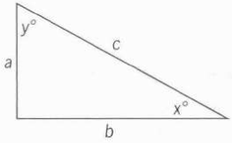

In the triangle above, does a^2 + b^2 = c^2 ?</h3>

(1) $x + y = 90$

(2) $x = y$

[explanation](./amat_answer_explanation.md#Q49)

<fieldset> 

  

    <mark>
    (A) Statement (1) ALONE is sufficient, but Statement (2) alone is not sufficient.
    ✔    </mark>
  

  

    (B) Statement (2) ALONE is sufficient, but Statement (1) alone is not sufficient.
  

  

    (C) Both statements TOGHTHER are sufficient, but NIGHTHER statements ALONE is sufficient.
  

  

    (D) EACH statement ALONE is sufficient.
  

  

    (E) Statement (1) and (2) TOGHTHER are NOT sufficient.
  

  
</fieldset>

----

<h3>50- On Monday morning a certain machine ran continuously at a uniform rate to fill a production
order. At what time did it completely fill the order that morning?</h3>

(1) The machine began filling the order at 9:30 a.m.

(2) The machine had filled 1/2 of the order by 10:30 a.m. and 5/6 of the order by 11:10 a.m

[explanation](./amat_answer_explanation.md#Q50)

<fieldset> 

  

    (A) Statement (1) ALONE is sufficient, but Statement (2) alone is not sufficient.
  

  

    <mark>
    (B) Statement (2) ALONE is sufficient, but Statement (1) alone is not sufficient.
    ✔    </mark>
  

  

    (C) Both statements TOGHTHER are sufficient, but NIGHTHER statements ALONE is sufficient.
  

  

    (D) EACH statement ALONE is sufficient.
  

  

    (E) Statement (1) and (2) TOGHTHER are NOT sufficient.
  

  
</fieldset>

----

<h3>51- What were the gross revenues from ticket sales for a certain film during the second week in
which it was shown?</h3>

(1) Gross revenues during the second week were $1.5 million less than during the first week.

(2) Gross revenues during the third week were $2.0 million less than during the first week.

[explanation](./amat_answer_explanation.md#Q51)

<fieldset> 

  

    (A) Statement (1) ALONE is sufficient, but Statement (2) alone is not sufficient.
  

  

    (B) Statement (2) ALONE is sufficient, but Statement (1) alone is not sufficient.
  

  

    (C) Both statements TOGHTHER are sufficient, but NIGHTHER statements ALONE is sufficient.
  

  

    (D) EACH statement ALONE is sufficient.
  

  

    <mark>
    (E) Statement (1) and (2) TOGHTHER are NOT sufficient.
    ✔    </mark>
  

  
</fieldset>

----

<h3>52- Last year, if Elena spent a total of $720 on newspapers, magazines, and books, what amount
did she spend on newspapers?</h3>

(1)Last year, the amount that Elena spent on magazines was 80 percent of the amount that she
spent on books.

(2)Last year, the amount that Elena spent on newspapers was 60 percent of the total amount
that she spent on magazines and books.

[explanation](./amat_answer_explanation.md#Q52)

<fieldset> 

  

    (A) Statement (1) ALONE is sufficient, but Statement (2) alone is not sufficient.
  

  

    <mark>
    (B) Statement (2) ALONE is sufficient, but Statement (1) alone is not sufficient.
    ✔    </mark>
  

  

    (C) Both statements TOGHTHER are sufficient, but NIGHTHER statements ALONE is sufficient.
  

  

    (D) EACH statement ALONE is sufficient.
  

  

    (E) Statement (1) and (2) TOGHTHER are NOT sufficient.
  

  
</fieldset>

----

<h3>53- At a certain picnic, each of the guests was served either a single scoop or a double scoop of ice crea. How many of the guests were served a double scoop of ice cream?</h3>

(1) At the picnic, 60 percent of the guests were served a double scoop of ice cream.

(2) A total of 120 scoops of ice cream were served to all the guests at the picnic.

[explanation](./amat_answer_explanation.md#Q53)

<fieldset> 

  

    (A) Statement (1) ALONE is sufficient, but Statement (2) alone is not sufficient.
  

  

    (B) Statement (2) ALONE is sufficient, but Statement (1) alone is not sufficient.
  

  

    <mark>
    (C) Both statements TOGHTHER are sufficient, but NIGHTHER statements ALONE is sufficient.
    ✔    </mark>
  

  

    (D) EACH statement ALONE is sufficient.
  

  

    (E) Statement (1) and (2) TOGHTHER are NOT sufficient.
  

  
</fieldset>

----

<h3>54- By What percent was the price of a ceratain candy bar increased?</h3>

(1) The price of the candy bar was increased by 5 cents.

(2) The price of the candy bar after the increase was 45 cents.

[explanation](./amat_answer_explanation.md#Q54)

<fieldset> 

  

    (A) Statement (1) ALONE is sufficient, but Statement (2) alone is not sufficient.
  

  

    (B) Statement (2) ALONE is sufficient, but Statement (1) alone is not sufficient.
  

  

    <mark>
    (C) Both statements TOGHTHER are sufficient, but NIGHTHER statements ALONE is sufficient.
    ✔    </mark>
  

  

    (D) EACH statement ALONE is sufficient.
  

  

    (E) Statement (1) and (2) TOGHTHER are NOT sufficient.
  

  
</fieldset>

----

<h3>55- 

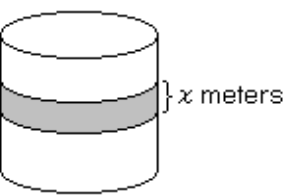

A circular tub has a band painted around its circumference, as shown above. What is the surface area of this painted band?</h3>

(1) $x = 0.5$

(2) The height of the tub is 1 meter.

[explanation](./amat_answer_explanation.md#Q55)

<fieldset> 

  

    (A) Statement (1) ALONE is sufficient, but Statement (2) alone is not sufficient.
  

  

    (B) Statement (2) ALONE is sufficient, but Statement (1) alone is not sufficient.
  

  

    (C) Both statements TOGHTHER are sufficient, but NIGHTHER statements ALONE is sufficient.
  

  

    (D) EACH statement ALONE is sufficient.
  

  

    <mark>
    (E) Statement (1) and (2) TOGHTHER are NOT sufficient.
    ✔    </mark>
  

  
</fieldset>

----

<h3>56- Is it true that a > b?</h3>

(1) $2a > 2b$

(2) $a + c > b + c $

[explanation](./amat_answer_explanation.md#Q56)

<fieldset> 

  

    (A) Statement (1) ALONE is sufficient, but Statement (2) alone is not sufficient.
  

  

    (B) Statement (2) ALONE is sufficient, but Statement (1) alone is not sufficient.
  

  

    (C) Both statements TOGHTHER are sufficient, but NIGHTHER statements ALONE is sufficient.
  

  

    <mark>
    (D) EACH statement ALONE is sufficient.
    ✔    </mark>
  

  

    (E) Statement (1) and (2) TOGHTHER are NOT sufficient.
  

  
</fieldset>

----

<h3>57- A throrughly blended biscuit mix includes only flour and baking powder. What is the ratio of the number of grams of baking powder to the number of grams of flour in the mix?</h3>

(1) Exactly 9.9 grams of flour is contained in 10 grams of the mix.

(2) Exactly 0.3 gram of baking powder is contained in 30 grams of the mix.

[explanation](./amat_answer_explanation.md#Q57)

<fieldset> 

  

    (A) Statement (1) ALONE is sufficient, but Statement (2) alone is not sufficient.
  

  

    (B) Statement (2) ALONE is sufficient, but Statement (1) alone is not sufficient.
  

  

    (C) Both statements TOGHTHER are sufficient, but NIGHTHER statements ALONE is sufficient.
  

  

    <mark>
    (D) EACH statement ALONE is sufficient.
    ✔    </mark>
  

  

    (E) Statement (1) and (2) TOGHTHER are NOT sufficient.
  

  
</fieldset>

----

<h3>58- If a real estate agent received a commision of 6 percent of the selling price of a certain house, what was the selling price of a certain house, what was the selling price of the house?</h3>

(1) The selling price minus the real estate agent's commision was \$84,600.

(2) The selling price was 250 percent of the original purchase price of \$36,000.

[explanation](./amat_answer_explanation.md#Q58)

<fieldset> 

  

    (A) Statement (1) ALONE is sufficient, but Statement (2) alone is not sufficient.
  

  

    (B) Statement (2) ALONE is sufficient, but Statement (1) alone is not sufficient.
  

  

    (C) Both statements TOGHTHER are sufficient, but NIGHTHER statements ALONE is sufficient.
  

  

    <mark>
    (D) EACH statement ALONE is sufficient.
    ✔    </mark>
  

  

    (E) Statement (1) and (2) TOGHTHER are NOT sufficient.
  

  
</fieldset>

----

<h3>59- What is the value of |x|?</h3>

(1) $x = -|x|$

(2) $x^2 = 4$

[explanation](./amat_answer_explanation.md#Q59)

<fieldset> 

  

    (A) Statement (1) ALONE is sufficient, but Statement (2) alone is not sufficient.
  

  

    <mark>
    (B) Statement (2) ALONE is sufficient, but Statement (1) alone is not sufficient.
    ✔    </mark>
  

  

    (C) Both statements TOGHTHER are sufficient, but NIGHTHER statements ALONE is sufficient.
  

  

    (D) EACH statement ALONE is sufficient.
  

  

    (E) Statement (1) and (2) TOGHTHER are NOT sufficient.
  

  
</fieldset>

----

<h3>60- 

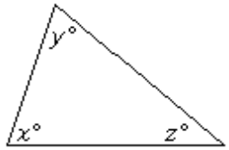

What is the value of z in the triangle above?</h3>

(1) $x + y = 139$

(2) $y + z = 108$

[explanation](./amat_answer_explanation.md#Q60)

<fieldset> 

  

    <mark>
    (A) Statement (1) ALONE is sufficient, but Statement (2) alone is not sufficient.
    ✔    </mark>
  

  

    (B) Statement (2) ALONE is sufficient, but Statement (1) alone is not sufficient.
  

  

    (C) Both statements TOGHTHER are sufficient, but NIGHTHER statements ALONE is sufficient.
  

  

    (D) EACH statement ALONE is sufficient.
  

  

    (E) Statement (1) and (2) TOGHTHER are NOT sufficient.
  

  
</fieldset>

----

<h3>61- A certain bakery sells rye bread in 16-ounce loaves and 24-ounce loaves, and all loaves of the same size sell for the same price per loaf regardless of the number of loaves purchased. What is the price of a 24-ounce loaf of rye bread in this bakery?</h3>

(1) The total price of a 16-ounce loaf and a 24-ounce loaf of this bread is \$2.40.

(2) The total price of two 16-ounce loaves and one 24-ounce loaf of this bread is \$3.40.

[explanation](./amat_answer_explanation.md#Q61)

<fieldset> 

  

    (A) Statement (1) ALONE is sufficient, but Statement (2) alone is not sufficient.
  

  

    (B) Statement (2) ALONE is sufficient, but Statement (1) alone is not sufficient.
  

  

    <mark>
    (C) Both statements TOGHTHER are sufficient, but NIGHTHER statements ALONE is sufficient.
    ✔    </mark>
  

  

    (D) EACH statement ALONE is sufficient.
  

  

    (E) Statement (1) and (2) TOGHTHER are NOT sufficient.
  

  
</fieldset>

----

<h3>62- If √x/y = n, What is the value of x?<h3>

(1) $yn = 10$

(2) $y = 40$ and $n = \frac{1}{4}$

[explanation](./amat_answer_explanation.md#Q62)

<fieldset> 

  

    (A) Statement (1) ALONE is sufficient, but Statement (2) alone is not sufficient.
  

  

    (B) Statement (2) ALONE is sufficient, but Statement (1) alone is not sufficient.
  

  

    (C) Both statements TOGHTHER are sufficient, but NIGHTHER statements ALONE is sufficient.
  

  

    <mark>
    (D) EACH statement ALONE is sufficient.
    ✔    </mark>
  

  

    (E) Statement (1) and (2) TOGHTHER are NOT sufficient.
  

  
</fieldset>

----

<h3>63- if m and n are consecutive positive integers, is m greater than n?<h3>

(1) $m - 1$ and $n + 1$ are consecutive positive integers.

(2) $m$ is an even integer.

[explanation](./amat_answer_explanation.md#Q62)

<fieldset> 

  

    <mark>
    (A) Statement (1) ALONE is sufficient, but Statement (2) alone is not sufficient.
    ✔    </mark>
  

  

    (B) Statement (2) ALONE is sufficient, but Statement (1) alone is not sufficient.
  

  

    (C) Both statements TOGHTHER are sufficient, but NIGHTHER statements ALONE is sufficient.
  

  

    (D) EACH statement ALONE is sufficient.
  

  

    (E) Statement (1) and (2) TOGHTHER are NOT sufficient.
  

  
</fieldset>

----

<h3>64- Paula and Sandy were among those people who sold raffle tickets to raise money for Club X. If Paula and Sandy sold a total of 100 of the tickets, How many of the tickets did Paula Sell?</h3>

(1) Sandy sold $\frac{2}{3}$ as many of the raffle tickets as Paula did.

(2) Sandy sold 8 percent of all the raffle tickets sold for club X.

[explanation](./amat_answer_explanation.md#Q64)

answer is A

<fieldset> 

  

    <mark>
    (A) Statement (1) ALONE is sufficient, but Statement (2) alone is not sufficient.
    ✔    </mark>
  

  

    (B) Statement (2) ALONE is sufficient, but Statement (1) alone is not sufficient.
  

  

    (C) Both statements TOGHTHER are sufficient, but NIGHTHER statements ALONE is sufficient.
  

  

    (D) EACH statement ALONE is sufficient.
  

  

    (E) Statement (1) and (2) TOGHTHER are NOT sufficient.
  

  
</fieldset>

----

<h3>65- Is the integer n odd?</h3>

(1) $n$ is divisible by 3.

(2) $n$ is divisible by 5.

[explanation](./amat_answer_explanation.md#Q65)

answer is E

<fieldset> 

  

    <mark>
    (A) Statement (1) ALONE is sufficient, but Statement (2) alone is not sufficient.
    ✔    </mark>
  

  

    (B) Statement (2) ALONE is sufficient, but Statement (1) alone is not sufficient.
  

  

    (C) Both statements TOGHTHER are sufficient, but NIGHTHER statements ALONE is sufficient.
  

  

    (D) EACH statement ALONE is sufficient.
  

  

    (E) Statement (1) and (2) TOGHTHER are NOT sufficient.
  

  
</fieldset>

----

<h3>66- If □ and △ each represent single digits in the decimal above, what digit does □ represent?</h3>

(1) When the decimal is rounded to the nearest tenth, 3.2 is the result.

(2) When the decimal is rounded to the nearest hunderdth, 3.24 is the result.

[explanation](./amat_answer_explanation.md#Q66)

answer is E

<fieldset> 

  

    <mark>
    (A) Statement (1) ALONE is sufficient, but Statement (2) alone is not sufficient.
    ✔    </mark>
  

  

    (B) Statement (2) ALONE is sufficient, but Statement (1) alone is not sufficient.
  

  

    (C) Both statements TOGHTHER are sufficient, but NIGHTHER statements ALONE is sufficient.
  

  

    (D) EACH statement ALONE is sufficient.
  

  

    (E) Statement (1) and (2) TOGHTHER are NOT sufficient.
  

  
</fieldset>

----

<h3>67- A certain company currently has how many employees?</h3>

(1) If 3 additional employees are hired by the company and all of the present employees remain, there will be at least 20 employees in the company.

(2) If no additional employees are hired by the company and 3 of the present employees resign, there will be fewer than 15 employees in the company.

[explanation](./amat_answer_explanation.md#Q67)

answer is C

<fieldset> 

  

    <mark>
    (A) Statement (1) ALONE is sufficient, but Statement (2) alone is not sufficient.
    ✔    </mark>
  

  

    (B) Statement (2) ALONE is sufficient, but Statement (1) alone is not sufficient.
  

  

    (C) Both statements TOGHTHER are sufficient, but NIGHTHER statements ALONE is sufficient.
  

  

    (D) EACH statement ALONE is sufficient.
  

  

    (E) Statement (1) and (2) TOGHTHER are NOT sufficient.
  

  
</fieldset>

----

<h3>68- If x is equal to one of the numbers 1/4, 3/8, or 2/5, What is the value of x?</h3>

(1) 1/4 < x < 1/2

(2) 1/3 < x < 3/5

[explanation](./amat_answer_explanation.md#Q68)

answer is E

<fieldset> 

  

    <mark>
    (A) Statement (1) ALONE is sufficient, but Statement (2) alone is not sufficient.
    ✔    </mark>
  

  

    (B) Statement (2) ALONE is sufficient, but Statement (1) alone is not sufficient.
  

  

    (C) Both statements TOGHTHER are sufficient, but NIGHTHER statements ALONE is sufficient.
  

  

    (D) EACH statement ALONE is sufficient.
  

  

    (E) Statement (1) and (2) TOGHTHER are NOT sufficient.
  

  
</fieldset>

----

<h3>69- If a, b, and c are integers, is a - b + c greater than a + b - c?</h3>

(1) b is negative.

(2) c is positive.

[explanation](./amat_answer_explanation.md#Q69)

answer is C

<fieldset> 

  

    <mark>
    (A) Statement (1) ALONE is sufficient, but Statement (2) alone is not sufficient.
    ✔    </mark>
  

  

    (B) Statement (2) ALONE is sufficient, but Statement (1) alone is not sufficient.
  

  

    (C) Both statements TOGHTHER are sufficient, but NIGHTHER statements ALONE is sufficient.
  

  

    (D) EACH statement ALONE is sufficient.
  

  

    (E) Statement (1) and (2) TOGHTHER are NOT sufficient.
  

  
</fieldset>

----

<h3>70- if x + 2y + 1 = y - x, What is the value of x?</h3>

(1) y^2 = 9

(2) y = 3

[explanation](./amat_answer_explanation.md#Q70)

answer is B

<fieldset> 

  

    <mark>
    (A) Statement (1) ALONE is sufficient, but Statement (2) alone is not sufficient.
    ✔    </mark>
  

  

    (B) Statement (2) ALONE is sufficient, but Statement (1) alone is not sufficient.
  

  

    (C) Both statements TOGHTHER are sufficient, but NIGHTHER statements ALONE is sufficient.
  

  

    (D) EACH statement ALONE is sufficient.
  

  

    (E) Statement (1) and (2) TOGHTHER are NOT sufficient.
  

  
</fieldset>

----

<h3>71- If n is an integer, then n is is divisible by how many positive integers?</h3>

(1) n is the product of two different prime numbers.

(2) n and 2^3 are each divisible by the same number of positive integers.

[explanation](./amat_answer_explanation.md#Q71)
answer is D

<fieldset> 

  

    <mark>
    (A) Statement (1) ALONE is sufficient, but Statement (2) alone is not sufficient.
    ✔    </mark>
  

  

    (B) Statement (2) ALONE is sufficient, but Statement (1) alone is not sufficient.
  

  

    (C) Both statements TOGHTHER are sufficient, but NIGHTHER statements ALONE is sufficient.
  

  

    (D) EACH statement ALONE is sufficient.
  

  

    (E) Statement (1) and (2) TOGHTHER are NOT sufficient.
  

  
</fieldset>

----

<h3>72- How many miles long is the route from Houghton to Callahan?</h3>

(1) It will take 1 hour less time to travel the entire route at an average rate of 55 miles per hour than at an average rate of 50 miles per hour.

(2) It will take 11 hours to travel the first half of the route at an average rate of 25 miles per hour.

[explanation](./amat_answer_explanation.md#Q72)
answer is D

<fieldset> 

  

    <mark>
    (A) Statement (1) ALONE is sufficient, but Statement (2) alone is not sufficient.
    ✔    </mark>
  

  

    (B) Statement (2) ALONE is sufficient, but Statement (1) alone is not sufficient.
  

  

    (C) Both statements TOGHTHER are sufficient, but NIGHTHER statements ALONE is sufficient.
  

  

    (D) EACH statement ALONE is sufficient.
  

  

    (E) Statement (1) and (2) TOGHTHER are NOT sufficient.
  

  
</fieldset>

----

<h3>73- If x and y are positive, What is the value of x?</h3>

(1) $x = 3.927y$

(2) $y = 2.279$

[explanation](./amat_answer_explanation.md#Q73)
answer is C

<fieldset> 

  

    <mark>
    (A) Statement (1) ALONE is sufficient, but Statement (2) alone is not sufficient.
    ✔    </mark>
  

  

    (B) Statement (2) ALONE is sufficient, but Statement (1) alone is not sufficient.
  

  

    (C) Both statements TOGHTHER are sufficient, but NIGHTHER statements ALONE is sufficient.
  

  

    (D) EACH statement ALONE is sufficient.
  

  

    (E) Statement (1) and (2) TOGHTHER are NOT sufficient.
  

  
</fieldset>

----

<h3>74- John and David each received a salary increase. Which one received the greater dollar increase?</h3>

(1) John's salary increased 8 percent.

(2) David's salary increased 5 percent.

[explanation](./amat_answer_explanation.md#Q74)

answer is E

<fieldset> 

  

    <mark>
    (A) Statement (1) ALONE is sufficient, but Statement (2) alone is not sufficient.
    ✔    </mark>
  

  

    (B) Statement (2) ALONE is sufficient, but Statement (1) alone is not sufficient.
  

  

    (C) Both statements TOGHTHER are sufficient, but NIGHTHER statements ALONE is sufficient.
  

  

    (D) EACH statement ALONE is sufficient.
  

  

    (E) Statement (1) and (2) TOGHTHER are NOT sufficient.
  

  
</fieldset>

----

<h3>75- Carlotta can drive from her home to her office by one of two possible routes. If she must also return by one of these routes, What is the distance of the shorter route?</h3>

(1) When she drives from her home to her office by the shorter route and returns by the longer route, she drives a total of 42 kilometers.

(2) When she drives both ways, from her home to her office and back, by the longer route, she drives a total of 46 kilometers.

[explanation](./amat_answer_explanation.md#Q75)

answer is C

<fieldset> 

  

    <mark>
    (A) Statement (1) ALONE is sufficient, but Statement (2) alone is not sufficient.
    ✔    </mark>
  

  

    (B) Statement (2) ALONE is sufficient, but Statement (1) alone is not sufficient.
  

  

    (C) Both statements TOGHTHER are sufficient, but NIGHTHER statements ALONE is sufficient.
  

  

    (D) EACH statement ALONE is sufficient.
  

  

    (E) Statement (1) and (2) TOGHTHER are NOT sufficient.
  

  
</fieldset>
----

<h3>76- If r and s are positive integers, r is what percent of s?</h3>

(1) $r = \frac{3}{4}s$

(2) $r ÷ s = \frac{75}{100}$

[explanation](./amat_answer_explanation.md#Q76)

answer is D

<fieldset> 

  

    <mark>
    (A) Statement (1) ALONE is sufficient, but Statement (2) alone is not sufficient.
    ✔    </mark>
  

  

    (B) Statement (2) ALONE is sufficient, but Statement (1) alone is not sufficient.
  

  

    (C) Both statements TOGHTHER are sufficient, but NIGHTHER statements ALONE is sufficient.
  

  

    (D) EACH statement ALONE is sufficient.
  

  

    (E) Statement (1) and (2) TOGHTHER are NOT sufficient.
  

  
</fieldset>

----

<h3>77- A shirt and a pair of gloves cost a total of $41.70. How much does the pair of gloves cost?</h3>

(1) The shirt costs twice as much as the gloves.

(2) The shirt costs $27.80.

[explanation](./amat_answer_explanation.md#Q77)

answer is D 

<fieldset> 

  

    <mark>
    (A) Statement (1) ALONE is sufficient, but Statement (2) alone is not sufficient.
    ✔    </mark>
  

  

    (B) Statement (2) ALONE is sufficient, but Statement (1) alone is not sufficient.
  

  

    (C) Both statements TOGHTHER are sufficient, but NIGHTHER statements ALONE is sufficient.
  

  

    (D) EACH statement ALONE is sufficient.
  

  

    (E) Statement (1) and (2) TOGHTHER are NOT sufficient.
  

  
</fieldset>

----

<h3>78- What is the number of 360-degree rotations that a bicycle wheel made while rolling 100 meters in a straight line without slipping?</h3>

(1) The diameter of the bicycle wheel, including the tire, was 0.5 meter.

(2) The wheel made twenty 360-degree rotations per minute.

[explanation](./amat_answer_explanation.md#Q78)

answer is A 

<fieldset> 

  

    <mark>
    (A) Statement (1) ALONE is sufficient, but Statement (2) alone is not sufficient.
    ✔    </mark>
  

  

    (B) Statement (2) ALONE is sufficient, but Statement (1) alone is not sufficient.
  

  

    (C) Both statements TOGHTHER are sufficient, but NIGHTHER statements ALONE is sufficient.
  

  

    (D) EACH statement ALONE is sufficient.
  

  

    (E) Statement (1) and (2) TOGHTHER are NOT sufficient.
  

  
</fieldset>

----

<h3>79- What is the value of the sum of a list of n odd integers?</h3>

(1) $n = 8$

(2) The square of the number of integers on the list is 64.

[explanation](./amat_answer_explanation.md#Q79)

answer is E

<fieldset> 

  

    <mark>
    (A) Statement (1) ALONE is sufficient, but Statement (2) alone is not sufficient.
    ✔    </mark>
  

  

    (B) Statement (2) ALONE is sufficient, but Statement (1) alone is not sufficient.
  

  

    (C) Both statements TOGHTHER are sufficient, but NIGHTHER statements ALONE is sufficient.
  

  

    (D) EACH statement ALONE is sufficient.
  

  

    (E) Statement (1) and (2) TOGHTHER are NOT sufficient.
  

  
</fieldset>

----

<h3>80- If a certain animated cartoon consists of a total of 17,280 frames on film, how many minutes will it take to run the cartoon?</h3>

(1) The cartoon runs without interruption at the rate of 24 frames per second.

(2) It takes 6 times as long to run the cartoon as it takes to rewind the film, and it takes a total of 14 minutes to do both.

[explanation](./amat_answer_explanation.md#Q80)
answer is E

<fieldset> 

  

    <mark>
    (A) Statement (1) ALONE is sufficient, but Statement (2) alone is not sufficient.
    ✔    </mark>
  

  

    (B) Statement (2) ALONE is sufficient, but Statement (1) alone is not sufficient.
  

  

    (C) Both statements TOGHTHER are sufficient, but NIGHTHER statements ALONE is sufficient.
  

  

    (D) EACH statement ALONE is sufficient.
  

  

    (E) Statement (1) and (2) TOGHTHER are NOT sufficient.
  

  
</fieldset>

----

<h3>81- What was the average number of miles per gallon of gasoline for a car during a certain trip?</h3>

(1) The total cost of the gasoline used by the car for the 180-mile trip was $12.00

(2) The cost of the gasoline used by the car for the trip was $1.20 per gallon.

[explanation](./amat_answer_explanation.md#Q81)

answer is C

<fieldset> 

  

    <mark>
    (A) Statement (1) ALONE is sufficient, but Statement (2) alone is not sufficient.
    ✔    </mark>
  

  

    (B) Statement (2) ALONE is sufficient, but Statement (1) alone is not sufficient.
  

  

    (C) Both statements TOGHTHER are sufficient, but NIGHTHER statements ALONE is sufficient.
  

  

    (D) EACH statement ALONE is sufficient.
  

  

    (E) Statement (1) and (2) TOGHTHER are NOT sufficient.
  

  
</fieldset>

----

<h3>82- If x and y are positive, is x/y greater than 1?</h3>

(1) $xy > 1$

(2) $x - y > 0$

[explanation](./amat_answer_explanation.md#Q82)

answer is B

<fieldset> 

  

    <mark>
    (A) Statement (1) ALONE is sufficient, but Statement (2) alone is not sufficient.
    ✔    </mark>
  

  

    (B) Statement (2) ALONE is sufficient, but Statement (1) alone is not sufficient.
  

  

    (C) Both statements TOGHTHER are sufficient, but NIGHTHER statements ALONE is sufficient.
  

  

    (D) EACH statement ALONE is sufficient.
  

  

    (E) Statement (1) and (2) TOGHTHER are NOT sufficient.
  

  
</fieldset>

----

<h3>83- In ΔPQR, if PQ = x, QR = x + 2, and PR = y, Which of the three angles of ΔPQR has the greatest degree measure?</h3>

(1) $y = x + 3$

(2) $x = 2$

[explanation](./amat_answer_explanation.md#Q83)

answer is A

<fieldset> 

  

    <mark>
    (A) Statement (1) ALONE is sufficient, but Statement (2) alone is not sufficient.
    ✔    </mark>
  

  

    (B) Statement (2) ALONE is sufficient, but Statement (1) alone is not sufficient.
  

  

    (C) Both statements TOGHTHER are sufficient, but NIGHTHER statements ALONE is sufficient.
  

  

    (D) EACH statement ALONE is sufficient.
  

  

    (E) Statement (1) and (2) TOGHTHER are NOT sufficient.
  

  
</fieldset>

----

<h3>84- Is the prime number p equal to 37?</h3>

(1) $p = n^2 + 1$, where n is an integer.

(2) $p^2$ is greater than 200.

[explanation](./amat_answer_explanation.md#Q84)

answer is E

<fieldset> 

  

    <mark>
    (A) Statement (1) ALONE is sufficient, but Statement (2) alone is not sufficient.
    ✔    </mark>
  

  

    (B) Statement (2) ALONE is sufficient, but Statement (1) alone is not sufficient.
  

  

    (C) Both statements TOGHTHER are sufficient, but NIGHTHER statements ALONE is sufficient.
  

  

    (D) EACH statement ALONE is sufficient.
  

  

    (E) Statement (1) and (2) TOGHTHER are NOT sufficient.
  

  
</fieldset>

----

<h3>85- The only contents of a parcel are 25 photographs and 30 negatives. What is the total weight, in ounces, of the parcel's contents?</h3>

(1) The weight of each photograph is 3 times the weight of each negative.

(2) The total weight of 1 of the photographs and 2 of the negatives is $\frac{1}{3}$ ounce.

[explanation](./amat_answer_explanation.md#Q85)

answer is C 

<fieldset> 

  

    <mark>
    (A) Statement (1) ALONE is sufficient, but Statement (2) alone is not sufficient.
    ✔    </mark>
  

  

    (B) Statement (2) ALONE is sufficient, but Statement (1) alone is not sufficient.
  

  

    (C) Both statements TOGHTHER are sufficient, but NIGHTHER statements ALONE is sufficient.
  

  

    (D) EACH statement ALONE is sufficient.
  

  

    (E) Statement (1) and (2) TOGHTHER are NOT sufficient.
  

  
</fieldset>

----

<h3>86- 

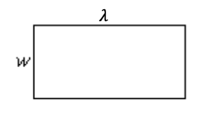

If 𝜆 and w represent the length and width, respectively, of the rectangle above, What is tht perimeter?</h3>

(1) $2𝜆 + w = 40$

(2) $𝜆 + w = 25$

[explanation](./amat_answer_explanation.md#Q86)
answer is B

<fieldset> 

  

    <mark>
    (A) Statement (1) ALONE is sufficient, but Statement (2) alone is not sufficient.
    ✔    </mark>
  

  

    (B) Statement (2) ALONE is sufficient, but Statement (1) alone is not sufficient.
  

  

    (C) Both statements TOGHTHER are sufficient, but NIGHTHER statements ALONE is sufficient.
  

  

    (D) EACH statement ALONE is sufficient.
  

  

    (E) Statement (1) and (2) TOGHTHER are NOT sufficient.
  

  
</fieldset>

----

<h3>87- What is the ratio of x to y?</h3>

(1) $x$ is 4 more than twice $y$.

(2) The ratio of $0.5x$ to $2y$ is 3 to 5.

[explanation](./amat_answer_explanation.md#Q87)

answer is B

<fieldset> 

  

    <mark>
    (A) Statement (1) ALONE is sufficient, but Statement (2) alone is not sufficient.
    ✔    </mark>
  

  

    (B) Statement (2) ALONE is sufficient, but Statement (1) alone is not sufficient.
  

  

    (C) Both statements TOGHTHER are sufficient, but NIGHTHER statements ALONE is sufficient.
  

  

    (D) EACH statement ALONE is sufficient.
  

  

    (E) Statement (1) and (2) TOGHTHER are NOT sufficient.
  

  
</fieldset>

----

<h3>88- if x, y and z are three integers, are they consecutive integers?</h3>

(1) $z - x = 2$

(2) x < y < z

[explanation](./amat_answer_explanation.md#Q88)

answer is C

<fieldset> 

  

    <mark>
    (A) Statement (1) ALONE is sufficient, but Statement (2) alone is not sufficient.
    ✔    </mark>
  

  

    (B) Statement (2) ALONE is sufficient, but Statement (1) alone is not sufficient.
  

  

    (C) Both statements TOGHTHER are sufficient, but NIGHTHER statements ALONE is sufficient.
  

  

    (D) EACH statement ALONE is sufficient.
  

  

    (E) Statement (1) and (2) TOGHTHER are NOT sufficient.
  

  
</fieldset>

----

<h3>89- What is the value of x?</h3>

(1) $-(x + y) = x - y$

(2) $x + y = 2$

[explanation](./amat_answer_explanation.md#Q89)

answer is A

<fieldset> 

  

    <mark>
    (A) Statement (1) ALONE is sufficient, but Statement (2) alone is not sufficient.
    ✔    </mark>
  

  

    (B) Statement (2) ALONE is sufficient, but Statement (1) alone is not sufficient.
  

  

    (C) Both statements TOGHTHER are sufficient, but NIGHTHER statements ALONE is sufficient.
  

  

    (D) EACH statement ALONE is sufficient.
  

  

    (E) Statement (1) and (2) TOGHTHER are NOT sufficient.
  

  
</fieldset>

----

<h3>90- A sum of $200,000 from a certain estate was divided among a spouse and three children. How much of the estate did the youngest child receive?</h3>

(1) The spouse received $\frac{1}{2}$ of the sum from the estate, and the oldest child received $\frac{1}{4}$ of the remainder.

(2) Each of the two younger children received $12,500 more than the oldest child and $62,500 less than the spouse.

[explanation](./amat_answer_explanation.md#Q90)

answer is B

<fieldset> 

  

    <mark>
    (A) Statement (1) ALONE is sufficient, but Statement (2) alone is not sufficient.
    ✔    </mark>
  

  

    (B) Statement (2) ALONE is sufficient, but Statement (1) alone is not sufficient.
  

  

    (C) Both statements TOGHTHER are sufficient, but NIGHTHER statements ALONE is sufficient.
  

  

    (D) EACH statement ALONE is sufficient.
  

  

    (E) Statement (1) and (2) TOGHTHER are NOT sufficient.
  

  
</fieldset>

----

<h3>91- If the Lincoln library's total expenditure for books, periodicals, and newspapers last year was $35,000 How much of the expenditure was for books?</h3>

(1) The expenditure for newspapers was 40 percent greater than the expenditure for periodicals.

(2) The total of the expenditure for periodicals and newspapers was 25 percent less than the expenditure for books.

[explanation](./amat_answer_explanation.md#Q91)

answer is B

<fieldset> 

  

    <mark>
    (A) Statement (1) ALONE is sufficient, but Statement (2) alone is not sufficient.
    ✔    </mark>
  

  

    (B) Statement (2) ALONE is sufficient, but Statement (1) alone is not sufficient.
  

  

    (C) Both statements TOGHTHER are sufficient, but NIGHTHER statements ALONE is sufficient.
  

  

    (D) EACH statement ALONE is sufficient.
  

  

    (E) Statement (1) and (2) TOGHTHER are NOT sufficient.
  

  
</fieldset>

----

92- The symbol ▽ represents one of the following operations: addition, subtraction, multiplication, or division. What is the value of 3 ▽ 2?

(1) $0▽1 = 1$

(2) $1▽0 = 1$

answer is A

----

93- The regular price for canned soup was reduced during a sale. How much money could one have saved by purchasing a dozen 7-ounce cans of soup at the reduced price rather than at the regular price?

(1) The regular price for the 7-ounce cans was 3 for a dollar.

(2) The reduced price for the 7-ounce cans was 4 for a dollar. 

answer is C

----

94- If on a fishing trip Jim and Tom each caught some fish, which one caught more fish?

(1) Jim caught $\frac{2}{3}$ as many fish as Tom.

(2) After Tom stopped fishing, Jim continued to fish until he caught 12 fish. 

answer is A 

----

95- If 5x + 3y = 17, What is the value of x?

(1) $x$ is a positive integer.

(2) $y = 4x$

answer is B

----

96- Yesterday Nan parked her car at a certain parking garage that charges more for the first hour than for each additional hour. If Nan's total parking charge at the garage yesterday was $3.75, for how many hours of parking was she charged?

(1) Parking charges at the garage are $0.75 for the first hour and $0.50 for each additional hour or fraction of an hour.

(2) If the charge for the first hour had been $1.00, Nan’s total parking charge would have been $4.00.

answer is A 

----

<h3>97- If r and s are integers, is r + s divisible by 3?</h3>

(1) $s$ is divisble by 3.

(2) $r$ is divisible by 3.

[explanation](./amat_answer_explanation.md#Q97)

answer is C

<fieldset> 

  

    <mark>
    (A) Statement (1) ALONE is sufficient, but Statement (2) alone is not sufficient.
    ✔    </mark>
  

  

    (B) Statement (2) ALONE is sufficient, but Statement (1) alone is not sufficient.
  

  

    (C) Both statements TOGHTHER are sufficient, but NIGHTHER statements ALONE is sufficient.
  

  

    (D) EACH statement ALONE is sufficient.
  

  

    (E) Statement (1) and (2) TOGHTHER are NOT sufficient.
  

  
</fieldset>

----
98- 

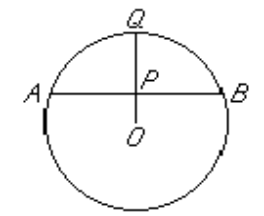

What is the radius of the circle above with center O?

(1) The ratio of $OP$ to $PQ$ is 1 to 2.

(2) $P$ is the midpoint of chord $AB$.

answer is E 

----

99- A certain 4-liter solution of vinegar and water consists of x liters of vinegar and y liters of water. How many liters of vinegar does the solution contain?

(1) $\frac{x}{4} = \frac{3}{8}$

(2) $\frac{y}{4} = \frac{5}{8}$

answer is D 

----

100- Is x < 0 ?

(1) $-x > 0$

(2) $x^3 < 0$

answer is D 

----

101- Of the 230 single-family homes built in City X last year, how many were occupied at the end of the year?

(1) Of all single-family homes in City X, 90 percent were occupied at the end of last year.

(2) A total of 7,200 single-family homes in City X were occupied at the end of last year. 

answer is E 

----

<h3>102- Does the product jkmn equal 1?</h3>

(1) $\frac{jk}{mn} = 1$

(2) $j = \frac{1}{k}$ and $m = \frac{1}{4}$

[explanation](./amat_answer_explanation.md#Q102)

answer is B

<fieldset> 

  

    <mark>
    (A) Statement (1) ALONE is sufficient, but Statement (2) alone is not sufficient.
    ✔    </mark>
  

  

    (B) Statement (2) ALONE is sufficient, but Statement (1) alone is not sufficient.
  

  

    (C) Both statements TOGHTHER are sufficient, but NIGHTHER statements ALONE is sufficient.
  

  

    (D) EACH statement ALONE is sufficient.
  

  

    (E) Statement (1) and (2) TOGHTHER are NOT sufficient.
  

  
</fieldset>

----

103- How many of the boys in a group of 100 children have brown hair?

(1) Of the children in the group, 60 percent have brown hair.

(2) Of the children in the group, 40 are boys. 

answer is E 

----

104- Is the perimeter of square S greater than the perimeter of equilateral triangle T?

(1) The ratio of the length of a side of $S$ to the length of a side of $T$ is 4:5.

(2) The sum of the lengths of a side of $S$ and a side of $T$ is 18. 

answer is A 

----

<h3>105- If p and q are positive integers and pq = 24, What is the value of p?</h3>

(1) $\frac{q}{6}$ is an integer.

(2) $\frac{p}{2}$ is an integer.

[explanation](./amat_answer_explanation.md#Q105)

answer is E

<fieldset> 

  

    <mark>
    (A) Statement (1) ALONE is sufficient, but Statement (2) alone is not sufficient.
    ✔    </mark>
  

  

    (B) Statement (2) ALONE is sufficient, but Statement (1) alone is not sufficient.
  

  

    (C) Both statements TOGHTHER are sufficient, but NIGHTHER statements ALONE is sufficient.
  

  

    (D) EACH statement ALONE is sufficient.
  

  

    (E) Statement (1) and (2) TOGHTHER are NOT sufficient.
  

  
</fieldset>

----

<h3>106- If x ≠ 0, what is the value of ( x^p / x^q)^4 ?</h3>

(1) p = q

(2) x = 3

[explanation](./amat_answer_explanation.md#Q106)

answer is A

<fieldset> 

  

    <mark>
    (A) Statement (1) ALONE is sufficient, but Statement (2) alone is not sufficient.
    ✔    </mark>
  

  

    (B) Statement (2) ALONE is sufficient, but Statement (1) alone is not sufficient.
  

  

    (C) Both statements TOGHTHER are sufficient, but NIGHTHER statements ALONE is sufficient.
  

  

    (D) EACH statement ALONE is sufficient.
  

  

    (E) Statement (1) and (2) TOGHTHER are NOT sufficient.
  

  
</fieldset>

----

<h3>107- From May 1, 1960 to May 1, 1975, the closing price of a share of stock X doubled. What was the closing price of a share of stock X on May 1, 1960?</h3>

(1) From May 1, 1975 to May 1, 1984, the closing price of a share of stock X doubled.

(2) From May 1, 1975 to May 1, 1984, the closing price of a share of stock X increased by $4.50.

[explanation](./amat_answer_explanation.md#Q107)

answer is C

<fieldset> 

  

    <mark>
    (A) Statement (1) ALONE is sufficient, but Statement (2) alone is not sufficient.
    ✔    </mark>
  

  

    (B) Statement (2) ALONE is sufficient, but Statement (1) alone is not sufficient.
  

  

    (C) Both statements TOGHTHER are sufficient, but NIGHTHER statements ALONE is sufficient.
  

  

    (D) EACH statement ALONE is sufficient.
  

  

    (E) Statement (1) and (2) TOGHTHER are NOT sufficient.
  

  
</fieldset>

----

<h3>108- If d is a positive integer, is √d an integer?</h3>

(1) $d$ is the square of an integer.

(2) $√d$ is the square of an integer.

[explanation](./amat_answer_explanation.md#Q108)

answer is D 

<fieldset> 

  

    <mark>
    (A) Statement (1) ALONE is sufficient, but Statement (2) alone is not sufficient.
    ✔    </mark>
  

  

    (B) Statement (2) ALONE is sufficient, but Statement (1) alone is not sufficient.
  

  

    (C) Both statements TOGHTHER are sufficient, but NIGHTHER statements ALONE is sufficient.
  

  

    (D) EACH statement ALONE is sufficient.
  

  

    (E) Statement (1) and (2) TOGHTHER are NOT sufficient.
  

  
</fieldset>

----

109- If Q is an integer between 10 and 100, What is the value of Q?

(1) One of $Q$'s digits is 3 more than the other, and the sum of its digits is 9.

(2) $Q < 50$

answer is C 

----

110- If digit h is the hundredths' digit in the decimal d = 0.2h6, What is the value of d, rounded to the nearest tenth?

(1) $d < \frac{1}{4}$

(2) $h < 5$

answer is D 

----

<h3>111- What is the value of x² - y² ?</h3>

(1) $x - y = y + 2$

(2) $x - y = \frac{1}{x+y}$

[explanation](./amat_answer_explanation.md#Q111)

answer is B

<fieldset> 

  

    <mark>
    (A) Statement (1) ALONE is sufficient, but Statement (2) alone is not sufficient.
    ✔    </mark>
  

  

    (B) Statement (2) ALONE is sufficient, but Statement (1) alone is not sufficient.
  

  

    (C) Both statements TOGHTHER are sufficient, but NIGHTHER statements ALONE is sufficient.
  

  

    (D) EACH statement ALONE is sufficient.
  

  

    (E) Statement (1) and (2) TOGHTHER are NOT sufficient.
  

  
</fieldset>

----

112- if ∘ represents on the opertions +, -, and x, is k ∘ (𝜆 + m) = () + () for all numbers k, 𝜆, and m?

(1) $k ∘ 1$ is not equal to $1 ⚬ k$ for some numbers k.

(2) $∘$ represents subtraction.

answer is D 

----

# Problem Solving

----

1- List S consists of 10 consecutive odd integers, and list T consists of 5 consecutive even integers. If
the least integer in S is 7 more than the least integer in T, how much greater is the average
(arithmetic mean) of the integers in S than the average of the integers in T?

(A) 2
(B) 7
(C) 8
(D) 12
(E) 22

----

2- For every even positive integer m, f(m) represents the product of all even integers from 2 to m,
inclusive. For example, f(12) = 2 x 4 x 6 x 8 x 10 x 12. What is the greatest prime factor of f(24) ?
(A) 23
(B) 19
(C) 17
(D) 13
(E) 11

----

3- If a=1+1/4+1/16+1/64 and b=1+1/4a, then what is the value of a – b ?
(A). -85/256
(B). -1/256
(C). -1/4
(D). 125/256
(E). 169/256

----

4- A grocer has 400 pounds of coffee in stock, 20 percent of which is decaffeinated. If the grocer buys
another 100 pounds of coffee of which 60 percent is decaffeinated, what percent, by weight, of
the grocer’s stock of coffee is decaffeinated?
(A). 28%
(B). 30%
(C). 32%
(D). 34%
(E). 40%

----

5- Three business partners, Q, R, and S, agree to divide their total profit for a certain year in the
ratios 2:5:8, respectively. If Q's share was $4,000, what was the total profit of the business
partners for the year?
(A) $26,000
(B) $30,000
(C) $52,000
(D) $60,000
(E) $300,000

----

6- The number of rooms at Hotel G is 10 less than twice the number of rooms at Hotel H. If the total
number of rooms at Hotel G and Hotel H is 425, what is the number of rooms at Hotel G?
(A) 140
(B) 180
(C) 200
(D) 240
(E) 280

----

7- For all positive integers m and v, the expression m Θ v represents the remainder when m is
divided by v. What is the value of ((98 Θ 33) Θ 17) - (98 Θ (33 Θ 17))?
(A) -10
(B) -2
(C) 8
(D) 13
(E) 17

----

8- If the average (arithmetic mean) of 5 numbers j, j + 5, 2j – 1, 4j – 2, and 5j – 1 is 8, what is the
value of j?
(A) 1/3
(B) 7/13
(C) 1
(D) 3
(E) 8

----

9- There are five sales agents in a certain real estate office. One month Andy sold twice as many
properties as Ellen, Bob sold 3 more than Ellen, Cary sold twice as many as Bob, and Dora sold as
many as Bob and Ellen together. Who sold the most properties that month?
(a) Andy
(b) Bob
(c) Cary
(d) Dora
(e) Ellen

----

10- In the figure above, what is the area of triangular region BCD?
(A) 4√2
(B) 8
(C) 8√2
(D) 16
(E) 162

----

11-What is the perimeter, in meters, of a rectangular garden 6 meters wide that has the same area as
a rectangular playground 16 meters long and 12 meters wide?
(A) 48
(B) 56
(C) 60
(D) 76
(E) 192

----

12-A certain bridge is 4,024 feet long. Approximately how many minutes does it take to cross this
bridge at a constant speed of 20 miles per hour? (1 mile = 5,280 feet)
(A) 1
(B) 2
(C) 4
(D) 6
(E) 7

----

13-Becky rented a power tool from a rental shop. The rent for the tool was $12 for the first hour and
$3 for each additional hour. If Becky paid a total of $27, excluding sales tax, to rent the tool, for
how many hours did she rent it?
(A) 5
(B) 6
(C) 9
(D) 10
(E) 12

----

14-Today Rose is twice as old as Sam and Sam is 3 years younger than Tina . If Rose, Sam, and Tina
are all alive 4 years from today, which of the following must be true on that day?
I. Rose is twice as old as Sam.
II. Sam is 3 years younger than Tina.
III. Rose is older than Tina.
(A) I only
(B) II only
(C) III only
(D) I and II
(E) II and III

----

15- If O is the center of the circle above,
what fraction of the circular region is shaded?
(A) 1/12
(B) 1/9
(C) 1/6
(D) 1/4
(E) 1/3

----

16-A certain manufacturer produces items for which the production costs consist of annual fixed
costs totaling $130,000 and variable costs averaging $8 per item. If the manufacturer's selling
price per item is $15, how many items must the manufacturer produce and sell to earn an annual
profit of $150,000?
(A) 2,858
(B) 18,667
(C) 21,429
(D) 35,000
(E) 40,000

----

17-Five machines at a certain factory operate at the same constant rate. If four of these machines,
operating simultaneously, take 30 hours to fill a certain production order, how many fewer hours
does it take all five machines, operating simultaneously, to fill the same production order?
(A) 3
(B) 5
(C) 6
(D) 16
(E) 24

----

18-If Mario was 32 years old 8 years ago, how old was he x years ago?
(A) x-40
(B) x-24
(C) 40 -x
(D) 24 - x
(E) 24 + x

----

19-Company C produces toy trucks at a cost of $5.00 each for the first 100 trucks and $3.50 for each
additional truck. If 500 toy trucks were produced by Company C and sold for $10.00 each, what
was Company C’s gross profit?
(A) $2,250
(B) $2,500
(C) $3,100
(D) $3,250
(E) $3,500

----

20-The "prime sum" of an integer n greater than 1 is the sum of all the prime factors of n, including
repetitions. For example , the prime sum of 12 is 7, since 12 = 2 x 2 x 3 and 2 +2 + 3 = 7. For which
of the following integers is the prime sum greater than 35 ?
(A) 440
(b) 512
(C) 620
(D) 700
(E) 750

----

21-If x=−5/8 and y= −1/2 ,what is the value of the expression −2x−y^2?
(A). −3/2
(B). ‒1
(C). 1
(D). 3/2
(E). 74

----

22-Of the total amount that Jill spent on a shopping trip, excluding taxes, she spent 50 percent on
clothing, 20 percent on food, and 30 percent on other items. If Jill paid a 4 percent tax on the
clothing, no tax on the food, and an 8 percent tax on all other items, then the total tax that she
paid was what percent of the total amount that she spent, excluding taxes?
(A). 2.8%
(B). 3.6%
(C). 4.4%
(D). 5.2%
(E). 6.0%

----

23-At the opening of a trading day at a certain stock exchange, the price per share of stock K was $8.
If the price per share of stock K was $9 at the closing of the day, what was the percent increase in
the price per share of stock K for that day?

(A) 1.4%
(B) 5.9%
(C) 11.1%
(D) 12.5%
(E) 23.6%

----

24-To order certain plants from a catalog, it costs $3.00 per plant, plus a 5 percent sales tax, plus
$6.95 for shipping and handling regardless of the number of plants ordered. If Company C ordered
these plants from the catalog at the total cost of $69.95, how many plants did Company C order?
(A). 22
(B). 21
(C). 20
(D). 19
(E). 18

----

25-For all numbers s and t, the operation * is defined by s*t = (s - 1)(t + 1). If (-2)*x = -12, then x =
(A) 2
(B) 3
(C) 5
(D) 6
(E) 11

----

26-If S = {0, 4, 5, 2, 11, 8}, how much greater than the median of the numbers in S is the mean of the
numbers in S?
(A) 0.5
(B) 1.0
(C) 1.5
(D) 2.0
(E) 2.5

----

27-If x and k are integers and (12^x)(4^2x+1)=(2^k)(3^2)), what is the value of k ?
(A) 5
(B) 7
(C) 10
(D) 12
(E) 14

----

28-If 60 percent of a rectangular floor is covered by a rectangular rug that is 9 feet by 12 feet, what is
the area, in square feet, of the floor?
(A) 65
(B) 108
(C) 180
(D) 270
(E) 300

----

29-A rectangular tank has the dimensions of its base as 30 metres by 20 metres and a height of 10
metres. There are two taps attached to the tank such that each tap working alone at a constant
rate can fill the tank completely in 60 hours and 90 hours respectively.One of the walls of the
tank has holes along the height of the tank at a regular distance of 2 metres and the first such hole
is 2 metres above the base of the tank. The rate of water outflow from each hole is 10m3 per
hour. If both the taps are opened simultaneously in the empty tank, approximately how many
hours will it take to fill the tank completely?
(A) 36
(B) 42
(C) 48
(D) 54
(E) 60

----

30-Pipe A, pipe B and pipe C are used to fill a tank. The flow rate of pipe C is 25% less than pipe B. To
fill the empty tank completely, Pipe A and Pipe B together take one third the time taken by Pipe C
alone. If all three pipes can fill the tank in 15 hours, then find the time taken (in hours) by A alone
to fill the tank completely.
(A) 18
(B) 27
(C) 36
(D) 45
(E) 54

----

31-If x + y= 8z, then which of the following represents the average (arithmetic mean) of x, y, and z, in
terms of z ?
(A) 2z + 1
(B) 3z
(C) 5z
(D) z/3
(E) 3z/2

----

32- The average distance between the Sun and a certain planet is approximately 2.3 x 10^14 inches.
Which of the following is closest to the average distance between the Sun and the planet, in
kilometers? (1 kilometer is approximately 3.9 x 10^4 inches.)
(A) 7.1 x 10^8
(B) 5.9 x 10^9
(C) 1.6 x 10^10
(D) 1.6 x 10^11
(E) 5.9 x 10^11

----

33- A truck leaves a city at a speed of 40 mph. An hour later, a car leaves the same city and travels in
the same direction at a speed of 60 mph. How many hours after leaving the city will the car reach
the truck?
(A) 1 hour
(B) 1.5 hours
(C) 2 hours
(D) 2.5 hours
(E) 3 hour

----

34- 61.24∗(0.998)^2/√403
The expression above is approximately equal to
(A) 1
(B) 3
(C) 4
(D) 5
(E) 6

----

35-Which of the following fractions is equal to the decimal 0.0625?
(A) 5/8
(B) 3/8
(C) 1/16
(D) 1/18
(E) 3/80

----

36- A certain population of bacteria doubles every 10 minutes. If the number of bacteria in the
population initially was 10^4, what was the number in the population 1 hour later?
(A) 2(10^4)
(B) 6(10^4)
(C) (2^6)(10^4)
(D) (10^6)(10^4)
(E) (10^4)^6

----

37- A factory has two types of machines, Type A and B, and each type of machine works at a different
constant rate. If one machine of Type A and two machines of Type B could complete a certain
production order in 6 hours working together, and two machines of Type A and one machine of
Type B could complete the same production order in 4 hours working together, how many hours
would it take three machines of Type A working together to complete the production order?
(A) 8383
(B) 3
(C) 4
(D) 6
(E) 12

----

38- Working alone at its constant rate, pump X pumped out ¼ of the water in a tank in 2 hours. Then
pumps Y and Z started working and the three pumps, working simultaneously at their respective
constant rates, pumped out the rest of the water in 3 hours. If pump Y, working alone at its
constant rate, would have taken 18 hours to pump out the rest of the water, how many hours
would it have taken pump Z, working alone at its constant rate, to pump out all of the water that
was pumped out of the tank?
(A) 6
(B) 12
(C) 15
(D) 18
(E) 24

----

39- If set N consists of odd numbers of consecutive integers, starting with 1, what is the positive
difference between the average of the odd integers and the average of the even integers in set N?
(A) −1
(B) 0
(C) 1/2
(D) 1
(E) 2

----

40-Last year if 97 percent of the revenues of a company came from domestic sources and the
remaining revenues, totaling $450,000, came from foreign sources, what was the total of the
company's revenues?
(A) $ 1,350,000
(B) $ 1,500,000
(C) $ 4,500,000
(D) $ 15,000,000
(E) $150,000,000

----

41-Temperatures in degrees Celsius (C) can be converted to temperatures in degrees Fahrenheit (F)
by the formula F=9/5∗C+32. What is the temperature at which F = C?
(A) 20°
(B) (32/5) °
(C) 0°
(D) -20°
(E) -40°

----

42- Craig sells major appliances. For each appliance he sells, Craig receives a commission of $50 plus
10 percent of the selling price. During one particular week Craig sold 6 appliances for selling prices
totaling $3,620. What was the total of Craig's commissions for that week?
(A) $412
(B) $526
(C) $585
(D) $605
(E) $662

----

43-Working alone, Printers X, Y, and Z can do a certain printing job, consisting of a large number of
pages, in 12, 15, and 18 hours, respectively. What is the ratio of the time it takes Printer X to do
the job, working alone at its rate, to the time it takes Printers Y and Z to do the job, working
together at their individual rates?
(A) 4/11
(B) 1/2
(C) 15/22
(D) 22/15
(E) 11/4

----

44-If positive integers x and y are not both odd, which of the following must be even?
(A) xy
(B) x + y
(C) x - y
(D) x + y -1
(E) 2(x + y) – 1

----

45-In country X a returning tourist must pay 8 percent tax applied to the first $500 or less worth of
imported goods. If the total value is in excess of $500, he must pay an additional 15 percent tax on
the portion of the total value in excess of 500. What tax must be paid by a returning tourist who
imports good with a total value of $720?
A. $33
B. $70
C. $73
D. $92.60
E. $108

----

46 The sequence a1, a2, a3, a4, a5 is such that an=an−1+5 for 2≤n≤5. If a5=31, what is the value of a1?
(A) 1
(B) 6
(C) 11
(D) 16
(E) 21

----

47-If k is an integer and 2 < k < 7, for how many different values of k is there a triangle with sides of
lengths 2, 7, and k?
(A) one
(B) two
(C) three
(D) four
(E) five

----

48 If the perimeter of a rectangular garden plot is 34 feet and its area is 60 square feet, what is the
length of each of the longer sides?
(A) 5 ft
(B) 6 ft
(C) 10 ft
(D) 12 ft
(E) 15 ft

----

49-The price of a certain television set is discounted by 10 percent, and the reduced price is then
discounted by 10 percent. This series of successivediscounts is equivalent to a single discount of
(A) 20%
(B) 19%
(C) 18%
(D) 11%
(E) 10%

----

----
50- Machines A and B always operate independently and at their respective constant rates. When working alone, Machine A can fill a production lot in 5 hours, and Machine B can fill the same lot in $x$ hours. When the two machines operate simulaneously to fill the production lot, it takes them 2 hours to complete the job. What is the value of $x$?

(A) $3\frac{1}{3}$
(B) $3$
(C) $2\frac{1}{2}$
(D) $2\frac{1}{3}$
(E) $1\frac{1}{2}$

----

51- The annual interest rate earned by an investment increased by 10 percent from last year to this year. If the annual interest rate earned by the investment this year was 11 percent, What was the annual interest rate last year?

(A) 1%
(B) 1.1%
(C) 9.1%
(D) 10%
(E) 10.8%

----

52- After 4,000 gallons of water were added to a large water tank that was already filled to $\frac{3}{4}$ of its capacity, the tank was then at $\frac{4}{5}$ of its capacity. How many gallons of water does the tank hold when filled to capacity?

(A) 5,000
(B) 6,200
(C) 20,000
(D) 40,000
(E) 80,000

----

53- Guadalupe owns 2 rectangular tracts of land. One is 300 m by 500 m and the other is 250 m by 630 m. The combined area of these 2 tracts is how many square meters?

(A) 3,360
(B) 307,500
(C) 621,500
(D) 704,000
(E) 2,816,000

----

54- if $\frac{x}{4}$ is 2 more than $\frac{x}{8}$, then $x = $?

(A) 4
(B) 8
(C) 16
(D) 32
(E) 64

----

55- The annaul budget of a certain college is to be shown on a circl graph. If the size of each sector of the graph is to be proportional to the amount of the budget it represents, How many degrees of the circle should be used to represent an item that is 15 percent of the budget?

(A) 15°
(B) 36°
(C) 54°
(D) 90°
(E) 150°

----

56- One inlet pipe fills an empty tank in 5 hours. A second inlet pipe fills the same tank in 3 hours. if both pipes are used together, how long will it take to fill $\frac{2}{3}$ of the tank?

(A) $\frac{8}{15}$ hr
(B) $\frac{3}{4}$ hr
(C) $\frac{5}{4}$ hr
(D) $\frac{15}{8}$ hr
(E) $\frac{8}{3}$ hr

----

57- The maximum recommended pulse rate $R$, When exercising, for a person who is $x$ years of age is given by the equation $R = 176 - 0.8x$. What is the age, in years, of a person whose maximum recommended pulse rate when exercising is 140?

(A) 40
(B) 45
(C) 50
(D) 55
(E) 60

----

58- $2x + 2y = -4$
 
$4x + y = 1$
In the system of equation above, What is the value of $x$?

(A) $-3$
(B) $-1$
(C) $\frac{2}{5}$
(D) $1$
(E) $1\frac{1}{4}$

----

59- In the Johnsons' monthly budget, the dollar amounts allocated to household expenses, food, and miscellaneous items are in the ratio 5:2:1, respectively. If the total amount allocated to these three categories is $1,800, What is the amount allocated to food?

(A) $900
(B) $720
(C) $675
(D) $450
(E) $225

----

------------------------------

60- In Country X a returning tourist may import goods with a total value of $500 or less tax free, but must pay an 8 percent tax on the portion of the total value in excess of $500. What tax must be paid by a returning tourist who imports goods with a total value of $730 ?

(A) $58.40
(B) $40.00
(C) $24.60
(D) $18.40
(E) $16.00

----

61- If positive integers $x$ and $y$ are not both odd, which of the following must be even?

(A) $xy$
(B) $x + y$
{C) $x - y$
(D) $x + y - 1$
(E) $2(x+y)-1$

----

62- 0n 3 sales John has received commissions of $240, $80, and $110, and he has 1 additional sale pending. If John is to receive an average (arithmetic mean) commission of exactly $150 on the 4 sales, then the 4th commission must be

(A) $164
(B) $170
{C) $175
(D) $182
(E) $185

----

63- 1f the number $n$ of calculators sold per week varies with the price $p$ in dollars according to the equation $n = 300 - 20p$, What would be the total weekly revenue from the sale of $10 calculators?

{A) $100
(B) $300
(C) $1,000
(D) $2,800
(E) $3,000

----

64- If Mario was 32 years old 8 years ago, How old was he x years ago?
(A) $x-40$
(B) $x-24$
(C) $40-x$
(D) $24-x$
(E) $24+x$

----

65- Running at the same constant rate, 6 identical machines can produce a total of 270 bottles per minute. At this rate, How many bottles could 10 such machines produce in 4 minutes?

(A) 648
(B) 1,800
(C) 2,700
(D) 10,800
(E) 64,800

----

66- Three business partners, $Q$, $R$, and $S$, agree to divide their total profit for a certain year in the ratios 2:5:8, respectively. If $Q$'s share was $4,000, What was the total profit of the business partners for the year?

(A) $26,000
(B) $30,000
(C) $52,000
(D) $60,000
(E) $300,000

----

67-
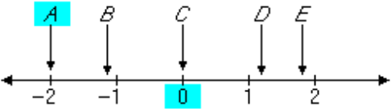
 
Of the five coordinates associated with points $A$, $8$, $C$, $D$, and $E$ on the number line above, Which has the greatest absolute value?

(A) A
(B) B
(C) C
(D) D
(E) E

----

68- A restaurant meal cost $35.50 and there was no tax. If the tip was more than 10 percent but less than 15 percent of the cost of the meal, then the total amount paid must have been between?

(A) $40 and $42
(B) §39 and $41
(C) §38 and §40
(D) §37 and §39
(E) §36 and §37

----

68- Harriet wants to put up fencing around three sides of her rectangular yard and leave a side of 20 feet unfenced. If the yard has an area of 680 square feet, how many feet of fencing does she need?

(A) 34
(B) 40
(C) 68
(D) 88
(E) 102

----

69- Increasing the original price of an article by 15 percent and then increasing the new price by 15 percent is equivalent to increasing the original price by

(A) 32.25%
(B) 31.00%
(C) 30.25%
(D) 30.00%
(E) 22.50%

----

70- If $k$ is an integer and $0.0010101 x 10^k$ is greater than 1,000, What is the least possible value of $k$ ?

(A) 2
(B) 3
(C) 4
(D) 5
(E) 6

----

71- If $(b—S)(4+\frac{2}{b})=0$ and $b≠3$,then $b=$

(A) $-8$
(B) $-2$
(C) $-\frac{1}{2}$
(D) $\frac{1}{2}$
(E) $2$

----

72- In a weight-lifting competition, the total weight of Joe's two lifts was 750 pounds. If twice the weight of his first lift was 300 pounds moare than the weight of his second lift, What was the weight, in pounds, of his first lift?

(A) 225
(B) 275
(C) 325
(D) 350
(E) 400

----

73- One hour after Yolanda started walking from $X$ to $Y$, a distance of 45 miles, Bob started walking along the same road from $Y$ to $X$, If Yolanda’s walking rate was 3 miles per hour and Bob’s was 4 miles per hour, How many miles had Bob walked when they met?

(A) 24
(B) 23
(C) 22
(D) 21
(E) 19.5

----

74- The average (arithmetic mean) of 6 numbers is 8.5. When one number is discarded, the average of the remaining numbers becomes 7.2. What is the discarded number?

(A) 7.8
(B) 9.8
(C) 10.0
(D) 12.4
(E) 15.0

----

75- 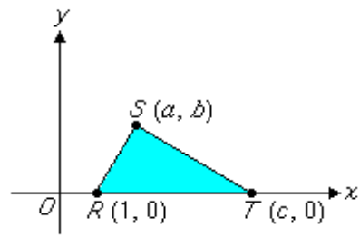
 
In the rectangular coordinate system above, the area of $\triangleRST$ is

(A) $\frac{bc}{2}$
(B) $\frac{b(c-1)}{2}$
(C) $\frac{c(b-1)}{2}$
(D) $\frac{a(c-1)}{2}$
(E) $\frac{c(a-1)}{2}$

----

76- Which of the following equations has a root in comman with $x² - 6x + 5 = 0$ ?

(A) $x² + 1 = 0$
(B) $x² - x - 2 = 0$
(C) $x² - 10x -5 = 0$
(D) $2x² - 2 = 0$
(E) $x² - 2x - 3 = 0$

----

77- One inlet pipe fills an empty tank in 5 hours. A second inlet pipe fills the same tank in 3 haurs. If both pipes are used together, How long will it take to fill $\frac{2}{3}$ of the tank?

(A) $\frac{8}{15}$ hr
(B) $\frac{3}{4}$ hr
(C) $\frac{5}{4}$ hr
(D) $\frac{15}{8}$ hr
(E) $\frac{8}{3}$ hr

----

78- During the first week of September, a shoe retailer sold 10 pairs of a certain style of oxfords at $35.00 a pair. If, during the second week of September, 15 pairs were sold at the sale price of $27.50 a pair, by what amount did the revenue from weekly sales of these oxfords increase during the second week?

(A) $62.50
(B) $75.00
(C) $112.50
(D) $137.20
(E) $175.00

----

79- The number $2 — 0.5$ is how many times the number $1 — 0.5$ ?

(A) 2
(B) 2.5
(C) 3
(D) 3.5
(E) 4

----

80- if $x = -1$, then $-(x^4 + x^3 + x² + x)$ =

(A) -10
(B) -4
(C) 0
(D) 4
(E) 10

----

81- Coins are dropped into a toll box so that the box is being filled at the rate of approximately 2 cubic feet per hour. If the empty rectangular box is 4 feet long, 4 feet wide, and 3 feet deep, approximately how many hours does it take to fill the box?

(A) 4
(B) 8
(C) 16
(D) 24
(E) 48

----

82- $(\frac{1}{5})² - (\frac{1}{5})(\frac{1}{4})$ =

(A) $-\frac{1}{20}$
(B) $-\frac{1}{100}$
(C) $\frac{1}{100}$
(D) $\frac{1}{20}$
(E) $\frac{1}{5}$

----

83- A club collected exactly $599 from its memebers. If each member contributed at least $12, What is the greatest number of members the club could have?

(A) 43
(B) 44
(C) 49
(D) 50
(E) 51

----

84- A union contract specifies a 6 percent salary increase plus a $450 bonus for each employee. For a certain employee, this is equivalent to an 8 percent salary increase. What was this employee’s salary before the new contract?

(A) $21,500
(B) $22,500
(C) $23,500
(D) $24,300
(E) $25,000

----

85- If $n$ is a positive integer and $k + 2 = 3^n$, Which of the following could not be a value of $k$ ?

(A) 1
(B) 4
(C) 7
(D) 25
(E) 79

----

86- Elena purchased brand $X$ pens for $4.00 a piece and brand $Y$ pens for $2.80 a piece. If Elena purchased a tatal of 12 of these pens for $42.00, How many brand $X$ pens did she purchase?

(A) 4
(B) 5
(C) 6
(D) 7
(E) 8

----

87- If the length and width of a rectangular garden plot were each increased by 20 percent, What would be the percent increase in the area of the plot?

(A) 20%
(B) 24%
(C) 36%
(D) 40%
(E) 44%

----

88- The population of a bacteria culture doubles every 2 minutes. Approximately how many minutes will it take for the population to grow from 1,000 to 500,000 bacteria?

(A) 10
(B) 12
(C) 14
(D) 16
(E) 18

----

89- When 10 is divided by the positive integer $n$, the remainder is $n — 4$. Which of the following could be the value of $n$ ?

(A) 3
(B) 4
(C) 7 answer
(D) 8
(E) 12

----

90- For a light that has an intensity of 60 candles at its source, the intensity in candles. $S$, of the light at a point $d$ feet from the source is given by the formula $S = \frac{60k}{d}$ , where $k$ is a constant. If the intensity of the light is 30 candles at a distance of 2 feet from the source, What is the intensity of the light at a distance of 20 feet from the source?

(A) $\frac{3}{10}$ candle
(B) $\frac{1}{2}$ candle
(C) $1\frac{1}{3}$ candles
(D) $2$ candles
(E) $3$ candles

----

91- If $x$ and $y$ are prime numbers, which of the following CAMNMNOT be the sum of $x$ and $y$ ?

(A) 5
(B) 9
(C) 13
(D) 16
(E) 23

----

92- Of the 3,600 employees of Company X, $\frac{1}{3}$ are clerical. If the clerical staff were to be reduced by $\frac{1}{3}$, What percent of the total number of the remaining employees would then be clerical?

(A) 25%
(B) 22.2%
(C) 20%
(D) 12.5%
(E) 11.1%

----

93- In which of the following pairs are the two numbers reciprocals of each other?
 

I. $3$ and $\frac{1}{3}$

II. $\frac{1}{17}$ and $\frac{-1}{17}$

III. $\sqrt{3}$ and $\frac{\sqrt{3}}{3}$

(A) I only
(B) II only
(C) I and II
(D) I and III
(E) II and III

----

94- What is 45 percent of $\frac{7}{12}$ of 240 ?

(A) 63
(B) 90
(C) 108
(D) 140
(E) 311

----

95- If $x$ books cost $5 each and $y$ books cost $8 each, then the average (arithmetic mean) cost, in dollars per book, is equal to

(A) $\frac{5x + 8y}{x + y}$
(B) $\frac{5x + 8y}{xy}$
(C) $\frac{5x + 8y}{13}$
(D) $\frac{40xy}{x + y}$
(E) $\frac{40xy}{13}$

----

96- If $\frac{1}{2}$ of the money in a certain trust fund was invested in stocks, $\frac{1}{4}$ in bonds, $\frac{1}{5}$ in a mutual fund, and the remaining $10,000 in a government certificate, What was the total amount of the trust fund?

(A) $100,000
(B) $150,000
(C) $200,000
(D) $500,000
(E) $2,000,000

----

97- Marion rented a car for $18.00 plus $0.10 per mile driven. Craig rented a car for $25.00 plus $0.05 per mile driven. If each drove $d$ miles and each was charged exactly the same amount for the rental, then $d$ equals

(A) 100
(B) 120
(C) 135
(D) 140
(E) 150

----

98- Machine $A$ produces bolts at a uniform rate of 120 every 40 seconds, and machine $B$ produces bolts at a uniform rate of 100 every 20 seconds. If the two machines run simultaneously, How many seconds will it take for them to produce a total of 200 bolts?

(A) 22
(B) 25
(C) 28
(D) 32
(E) 56

----

99- $\frac{3.003}{2.002}$ =

(A) 1.05
(B) 1.50015
(C) 1.501
(D) 1.5015
(E) 1.5

----

100- 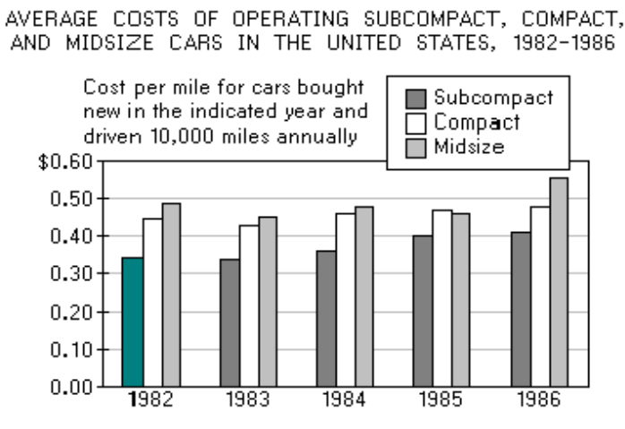
 

In 1982 the approximate average cost of operating a subcompact car for 10,000 miles was

(A) $360
(B) $3,400
(C) $4,100
(D) $4,500
(E) $4,900

----

101- 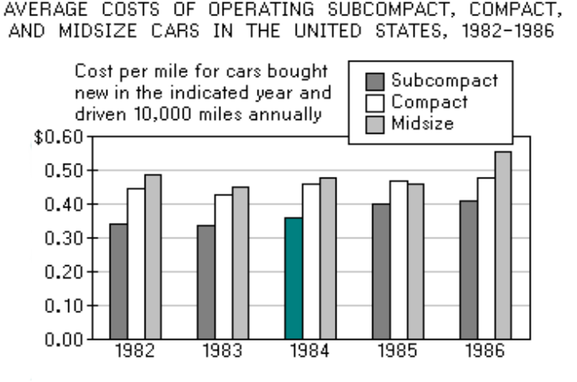
 

In 1984 the average cost of operating a subcompact car was approximately what percent less than the average cost of operating a midsized car?

(A) 12%
(B) 20%
(C) 25%
(D) 33%
(E) 48%

----

102- 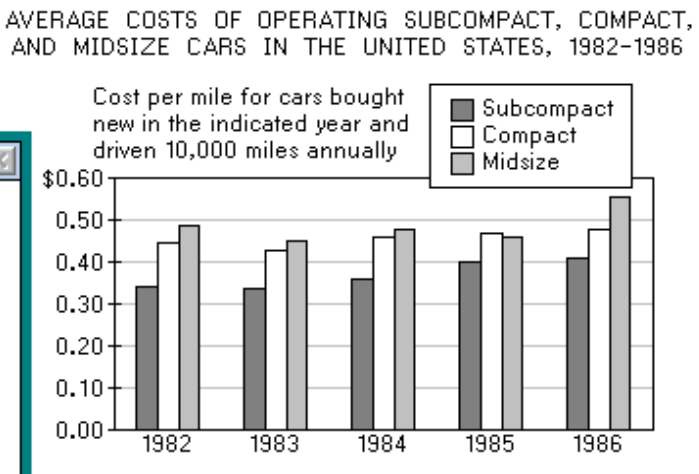

 

For each of the years shown, the average cost per mile of operating a compact car minus the average cost per mile of operating a subcompact car was between

(A) $0.12 and $0.18
(B) $0.10 and $0.15
(C) $0.09 and $0.13
(D) $0.06 and $0.12
(E) $0.05 and $0.08

----

103- What is the decimal equivalent of $(\frac{1}{5})^5$ ?

(A) 0.00032
(B) 0.0016
(C) 0.00625
(D) 0.008
(E) 0.03125

----

104- Two hundred gallons of fuel oil are purchased at $0.91 per gallon and are consumed at a rate of $0.70 worth of fuel per hour. At this rate, How many hours are required to consume the 200 gallons of fuel oil?

(A) 140
(B) 220
(C) 260
(D) 322
(E) 330

----

105- If $\frac{4 - x}{2 + x} = x$, What is the value of $x² + 3x —4$ ?

(A) -4
(B) -1
(C) 0
(D) 1
(E) 2

----

106- If $b < 2$ and $2x - 3b = 0$, Which of the following must be true?

(A) $x > -3$
(B) $x < 2$
(C) $x = 3$
(D) $x < 3$
(E) $x > 3$

----

107- 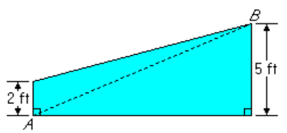

 
The trapezoid shown in the figure above represents a cross section of the rudder of a ship. If the distance from $A$ to $B$ is 13 feet, What is the area of the cross section of the rudder in square feet?

(A) 39
(B) 40
(C) 42
(D) 45
(E) 46.5

----

108- $\frac{(-1.5)(1.2) - (4.5)(0.4)}{30}$

(A) -1.2
(B) -0.12
(C) 0
(D) 0.12
(E) 1.2

----

109- If $n$ is a positive integer, then $n(n + 1)(n + 2)$ is

(A) even only when $n$ is even
(B) even only when $n$ is odd
(C) odd whenewer $n$ is odd
(D) divisible by 3 only when $n$ is odd
(C) divisible by 4 whenever $n$ is even

----

110- If Jack had twice the amount of money that he has, he would have exactly the amount necessary to buy 3 hamburgers at $0.96 a piece and 2 milk shakes at $1.28 a piece. How much money does Jack have?

(A) $1.60
(B) $2.24
(C) $2.72
(D) $3.36
(E) $5.44

----

111- If a photocopier makes 2 copies in $\frac{1}{3}$ second, then, at the same rate, How many copies does it make in 4 minutes?

(A) 360
(B) 480
(C) 576
(D) 720
(E) 1,440

----

112- The price of a certain television set is discounted by 10 percent, and the reduced price is then discounted by 10 percent. This series of successive discounts is equivalent to a single discount of?

(A) 20%
(B) 19%
(C) 18%
(D) 11%
(E) 10%

----

113- If $\frac{2}{1 + \frac{2}{y}} = 1$, then $y$ =

(A) $-2$
(B) $-\frac{1}{2}$
(C) $\frac{1}{2}$
(D) $2$
(E) $3$

----

114- If a rectangular photograph that is 10 inches wide by 15 inches long is to be enlarged so that the width will be 22 inches and the ratio of width to length will be unchanged, then the length, in inches, of the enlarged photograph will be

(A) 33
(B) 32
(C) 30
(D) 27
(E) 25

----

115- If $m$ is an integer such that $(—2)^2m = 2^9-m$, then $m$ =

(A) 1
(B) 2
(C) 3
(D) 4
(E) 6

----

116- If $0 ≤ x ≤ 4$ and $y < 12$, Which of the following CANNOT be the value of $xy$ ?

(A) -2
(B) 0
(C) 6
(D) 24
(E) 48

----

117- 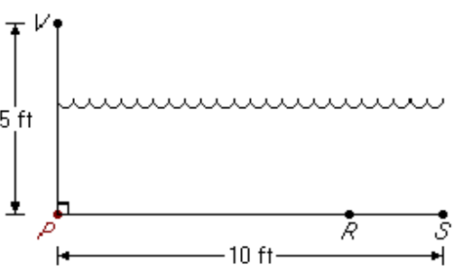

 
In the figure above, $V$ represents an observation point at one end of a pool. From $V$, an object that is actually located on the bottorm of the pool at point $R$ appears to be at point $S$. If $VR = 10 feet$, What is the distance $RS$, in feet, between the actual position and the percerved position of the object?

(A) $10 - 5 \sqrt{3}$
(B) $10 - 5 \sqrt{2}$
(C) $2$
(D) $2\frac{1}{2}$
(E) $4$

----

118- If the total payroll expense of a certain business in year $Y$ was $84,000, which was 20 percent more than in year $X$, What was the total payroll expense in year $X$ ?

(A) $70,000
(B) $68,320
(C) $64,000
(D) $60,000
(E) $52,320

----

119- If $a$, $b$, and $c$ are consecutive positive integers and $a < b < c$, Which of the following must be true?

I. $c - a = 2$

II. $abc$ is an even integer.

III. $\frac{a + b + c}{3}$ is an integer.

(A) I only
(B) II only
(C) I and II only
(D) II and III only
(E) I, II, and III

----

120- A straight pipe 1 yard in length was marked off in fourths and also in thirds. If the pipe was then cut into separate pieces at each of these markings, Which of the following gives all the different lengths of the pieces, in fractions of a yard?

(A) $\frac{1}{6}$ and $\frac{1}{4}$ only
(B) $\frac{1}{4}$ and $\frac{1}{3}$ only
(C) $\frac{1}{6}$, $\frac{1}{4}$ and $\frac{1}{3}$
(D) $\frac{1}{12}$, $\frac{1}{6}$ and $\frac{1}{4}$
(E) $\frac{1}{12}$, $\frac{1}{6}$ and $\frac{1}{3}$

----

121- What is the least infeger that is a sum of three different primes each greater than 20 ?

(A) 69
(B) 73
(C) 75
(D) 79
(E) 83

----

122- A tourist purchased a total of $1,500 worth of traveler’s checks in $10 and $50 denominations. During the trip the tourist cashed 7 checks and then lost all of the rest. If the number of $10 checks cashed was one more or one less than the number of $50 checks cashed, What is the minimum possible value of the checks that were lost?

(A) $1,430
(B) $1,310
(C) $1,290
(D) $1,270
(E) $1,150

----

123- 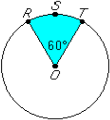
 
If the circle above has center $O$ and circumference $18π$, then the perimeter of sector $RSTO$ is

(A) $3π + 9$
(B) $3π + 18$
(C) $6π + 9$
(D) $6π + 18$
(E) $6π + 24$

----

124- If each of the following fractions were written as a repeating decimal, Which would have the longest sequence of different digits?

(A) $\frac{2}{11}$
(B) $\frac{1}{3}$
(C) $\frac{41}{99}$
(D) $\frac{2}{3}$
(E) $\frac{23}{37}$

----

125- Today Rose is twice as old as Sam and Sam is 3 years younger than Tina. If Rose, Sam, and Tina are all alive 4 years from today, Which of the following must be true on that day?

I. Rose is twice as old as Sam.

II. Sam is 3 years younger than Tina.

III. Rose is older than Tina.

(A) I only
(B) II only
(C) III only
(D) I and II
(E) II and III

----

126- The average (arithmetic mean) of 6, 8, and 10 equals the average of 7. 9, and

(A) 5
(B) 7
(C) 8
(D) 9
(E) 11

----

127- 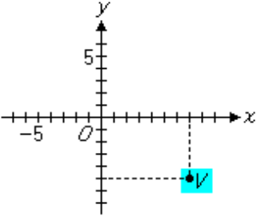
 
In the figure above, the coordinates of point $V$ are

(A) (-7, 5)
(B) (-5, 7)
(C) (5, 7)
(D) (7, 5)
(E) (7, -5)

----

128- Tickets for all but 100 seats in a 10,000-seat stadium were sold. Of the tickets sald, 20 percent were sold at half price and the remaining tickets were sold at the full price of $2. What was the total revenue from ticket sales?

(A) $15,840
(B) $17,820
(C) $18,000
(D) $19,800
(E) $21,780

----

129- In a mayoral election, Candidate $X$ received $\frac{1}{3}$ more votes than Candidate $Y$, and Candidate $Y$ received $\frac{1}{4}$ fewer votes than Candidate $Z$. If Candidate $Z$ received 24,000 votes, How many votes did Candidate $X$ receive?

(A) 18,000
(B) 22,000
(C) 24,000
(D) 26,000
(E) 32,000

----

130- René earns $8.50 per hour on days other than Sundays and twice that rate on Sundays. Last week she worked a total of 40 hours, including 8 hours on Sunday. What were her earnings for the week?

(A) $272
(B) $340
(C) $398
(D) $408
(E) $476

----

131- In a shipment of 120 machine parts, 5 percent were defective. In a shipment of 80 machine parts, 10 percent were defective. For the two shipments combined, What percent of the machine parts were defective?

(A) 6.5%
(B) 7.0%
(C) 7.5%
(D) 8.0%
(E) 8.5%

----

132- $\frac{2\frac{2}{5} - 1\frac{2}{3}}{\frac{2}{3} - \frac{3}{5}}$ =

(A) 16
(B) 14
(C) 3
(D) 1
(E) -1

----

133- If $x = -1$, then $\frac{x^4 - x^3 + x^2}{x - 1}$ =

(A) $-\frac{3}{2}$
(B) $-\frac{1}{2}$
(C) $0$
(D) $\frac{1}{2}$
(E) $\frac{3}{2}$

----

134- Which of the following equations is NOT equivalent to $25x^2 = y^2 - 4$ ?

(A) $25x^2 + 4 = y^2$
(B) $75x^2 = 3y^2 -12$
(C) $25x^2 = (y + 2)(y -2)$
(D) $5x = y - 2$
(E) $x^2 = \frac{y^2 -4}{25}$

----

135- A toy store regularly sells all stock at a discount of 20 percentto 40 percent. If an additional 25 percent were deducted from the discount price during a special sale, What would be the lowest possible price of a toy costing $16 before any discount?

(A) $5.60
(B) $7.20
(C) $8.80
(D) $9.60
(E) $15.20

----

136- If there are 664,579 prime numbers among the first 10 million positive integers, approximately What percent of the first 10 million positive integers are prime numbers?

(A) 0.0066%
(B) 0.066%
(C) 0.66%
(D) 6.6%
(E) 66%

----

137- A bank customer borrowed $10,000, but received $y$ dollars less than this due to discounting. If there was a separate $25 service charge, then, in terms of $y$, the service charge was What fraction of the amount that the customer received?

(A) $\frac{25}{10,000 -y}$
(B) $\frac{25}{10,000 - 25y}$
(C) $\frac{25y}{10,000 - y}$
(D) $\frac{y - 25}{10,000 - y}$
(E) $\frac{25}{10,000 - (y - 25)}$

----

138- An airline passenger is planning a trip that involves three connecting flights that leave from Airports $A$, $B$, and $C$, respectively. The first flight leaves Airport $A$ every hour, beginning at 8:00 a.m., and arrives at Airport $B$ $2\frac{1}{2}$ hours later. The second flight leaves Airport $B$ every 20 minutes, beginning at 8:00 a.m., and arrives at Airport $C$ $1\frac{1}{6}$ hours later. The third flight leaves Airport $C$ every hour, beginning at 8:45 a.m. What is the least total amount of time the passenger must spend between flights if all flights keep to their schedules?

(A) 25 min
(B) 1 hr 5 min
(C) 1 hr 15 min
(D) 2 hr 20 min
(E) 3 hr 40 min

----

139- 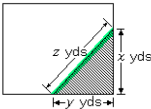
 
The shaded portion of the rectangular lot shown above represents a flower bed. If the area of the bed is 24 square yards and $x = y + 2$, then $z$ equals

(A) $\sqrt{13}$
(B) $2\sqrt{13}$
(C) $6$
(D) $8$
(E) $10$

----

140- How many multiples of 4 are there between 12 and 96, inclusive?

(A) 21
(B) 22
(C) 23
(D) 24
(E) 25

----

141- Jack is now 14 years older than Bill. If in 10 years Jack will be twice as old as Bill, How old will Jack be in 5 years?

(A) 9
(B) 19
(C) 21
(D) 23
(E) 33

----

142- In Country $X$ a returning tourist may import goods with a total value of $500 or less tax free, but must pay an 8 percent tax on the portion of the total value in excess of $500. What tax must be paid by a returning tourist who imports goods with a total value of $730 ?

(A) $58.40
(B) $40.00
(C) $24.60
(D) $18.40
(E) $16.00

----

143- Which of the following is greater than $\frac{2}{3}$ ?

(A) $\frac{33}{50}$
(B) $\frac{8}{11}$
(C) $\frac{3}{5}$
(D) $\frac{13}{27}$
(E) $\frac{5}{8}$

----

144- A rope 40 feet long is cut into two pieces. If one piece is 18 feet longer than the other, What is the length, in feet, of the shorter piece?

(A) 9
(B) 11
(C) 18
(D) 22
(E) 29

----

145- If 60 percent of a rectangular floor is covered by a rectangular rug that is 9 feet by 12 feet, What is the area, in square feet, of the floor?

(A) 65
(B) 108
(C) 180
(D) 270
(E) 300

----

146- The Earth travels around the Sun at a speed of approximately 18.5 miles per second. This approximate speed
is how many miles per hour?

(A) 1,080
(B) 1,160
(C) 64,800
(D) 66,600
(E) 3,996,000

----

147- A collection of books went on sale, and $\frac{2}{3}$ of them were sold for $2.50 each. If none of the 36 remaining books were sold, What was the total amount received for the books that were sold?

(A) $180
(B) $135
(C) $90
(D) $60
(E) $54

----

148- If “basis points” are defined so that 1 percent is equal to 100 basis points, then 82.5 percent is How many basis points greater than 62.5 percent?

(A) 0.02
(B) 0.2
(C) 20
(D) 200
(E) 2,000

----

149- The amounts of time that three secretaries worked on a special project are in the ratio of 1 to 2 to 5. If they worked a combined total of 112 hours, How many hours did the secretary who worked the longest spend on the project?

(A) 80
(B) 70
(C) 56
(D) 16
(E) 14

----

150- If the guotient $\frac{a}{b}$ is positive, Which of the following must be true?

(A) $a > 0$
(B) $b > 0$
(C) $ab > 0$
(D) $a - b > 0$
(E) $a + b > 0$

----

151- $8^2x+3 = 2^3x+6$, then $x$ =

(A) $-3$
(B) $-1$
(C) $0$
(D) $1$
(E) $3$

----

152- Of the following, the closest approximation to $\sqrt{\frac{2.98(601.5)}{15.79}}$ is

(A) 5
(B) 15
(C) 20
(D) 25
(E) 225

----

153- Which of the following CANNOT be the greatest commaon divisor of two positive integers $x$ and $y$ ?

(A) $1$
(B) $x$
(C) $y$
(D) $x - y$
(E) $x + y$

----

154- An empty pool being filled with water at a constant rate takes 8 hours to fill to $\frac{3}{5}$ of its capacity. How much more time will it take to finish filling the pool?

(A) 5 hr 30 min
(B) 5 hr 20 min
(C) 4 hr 48 min
(D) 3 hr 12 min
(E) 2 hr 40 min

----

155- A positive number $x$ is multiplied by 2, and this product is then divided by 3. If the positive square root of the result of these two operations equals $x$, What is the value of $x$ ?

(A) $\frac{9}{4}$
(B) $\frac{3}{2}$
(C) $\frac{4}{3}$
(D) $\frac{2}{3}$
(E) $\frac{1}{2}$

----

156- A tank contains 10,000 gallons of a solution that is 5 percent sodium chloride by volume. If 2,500 gallons of water evaporate from the tank, the remaining solufion will be approximately What percent sodium chloride?

(A) 1.25%
(B) 3.75%
(C) 6.25%
(D) 6.67%
(E) 11.7%

----

157- A certain grocery purchased $x$ pounds of produce for $p$ dollars per pound. If $y$ pounds of the produce had to be discarded due to spoilage and the grocery sold the rest for 5 dollars per pound, Which of the following represents the gross profit on the sale of the produce?

(A) $(x-y)s - xp$
(B) $(x-y)p-ys$
(C) $(s-p)y-xp$
(D) $xp-ys$
(E) $(x-y)(s-p)$

----

⚠ 158- If $x + 3y =21$ and $3x + y = 7$, then $x+y=$

- 6
- 2
- 7 ✔
- 4

----

⚠ 159- If $x+3y=40$ and $3x+y=4$, then $x+y=$

- 11 ✔
- 20
- 44
- 40

----

⚠ 160- If $x+3y=5$ and $3x+y=7$, then $x+y=$

- 1
- 2
- 3 ✔
- 4

----

⚠ 161- If $x+3y=10$ and $3x+y=6$, then $x+y=$

- 1
- 2
- 4 ✔
- 5

----
⚠ 162- If $x+y=7$ and $x^2+y^2= 25$, then which one of the following equals the value of $x^3+y^3=$?

- 7
- 25
- 35
- 91 ✔
- None of the above

----

⚠ 163- If $x + y = 7$ and $x² + y² = 25$, then which one of the following equals the value of $x^3 - y^3 =$?

- 107
- 20
- 35
- 37 ✔

----

⚠ 164- If $x + y = 7$ and $x - y = 3$, then which one of the following equals the value of $x² - y² =$?

- 7
- 21 ✔
- 35
- 9

----

⚠ 165- If $x + y = 4$ and $x² + y² = 16$, then which one of the following equals the value of $x⁵ + y⁵ =$?

- 256
- 1024 ✔
- 64
- 91

----

⚠ 166- If $x² – y² = 100$ and $x – y = 2$ then $x + y =$ ?

----

⚠ 167- If $9x – 6y$, then the ratio of $x$ to $y$ is

- 9:6
- 3:2
- 2:3 ✔
- 6:2

---- 

⚠ 168- If $9x = 3y$, then the ratio of $x$ to $y$ is

- 9:3
- 1:3 ✔
- 3:1
- 6:5

----

⚠ 169- If $4x = 5y$, then the ratio of $x$ to $y$ is

- 5:9
- 5:4 ✔
- 1:2
- 4:5

----

⚠ 170- How do you find the ratio of $x$ to $y$ given $5x = 6y$?

----
⚠ 171- The number of integers from 36 to 56 is

- 23
- 24
- 21 ✔
- 20

----

⚠ 172- The number of integers from 30 to 67 is

- 37
- 38 ✔
- 40
- 36
----

⚠ 173- How many integers are between -8 and 17, inclusive?

- 24
- 17
- 9
- 8
- 26 ✔

----

⚠ 174- What is the sum of odd integers from 35 to 85, inclusive?

(A) 1,560 ✔
(B) 1,500
(C) 1,240
(D) 1,120
(E) 1,100

----

⚠ 175- If $a$ and $b$ are integers, $x = 32a$, $y = 23b$, and the values of both $x$ and $y$ lie between 90 and 100 (not including the two), then $a – b$ could be

- -2
- -1 ✔
- 0
- 1

----

⚠ 176- If $a$ and $b$ are integers, $x = 36a$, $y = 32b$, and the values of both $x$ and $y$ lie between 250 and 260 (not including the two), then $a – b$ could

- -2
- -1 ✔
- 0
- 1

----

⚠ 177- If $a$ and $b$ are integers, $x = 14a$, $y = 12b$, and the values of both $x$ and $y$ lie between 80 and 90 (not including the two), then $a – b$ could be

- -2
- -1 ✔
- 0
- 1

----

⚠ 178- If $a$ and $b$ are integers, $x = 21a$, $y = 16b$, and the values of both $x$ and $y$ lie between 60 and 70 (not including the two), then $a – b$ could be

- -2
- -1 ✔
- 0
- 1

----
⚠ 179- $\frac{1}{1-(0.9)^2}$

- 36/35
- 100/9 ✔
- 19/100
- 30/11

----

⚠ 180- $\frac{1}{1-(0.8)^2}$

- 25/9 ✔
- 16/15
- 9/25
- 25/11

----
⚠ 181- $\frac{1}{1-(0.25)^2}$

----

⚠ 182- $\frac{1}{1-(0.3)^3}$

- 36/35
- 10/30
- 37/36 ✔
- 30/11

----
⚠ 183- What is the average of all prime numbers between 40 and 54?

- 43
- 45
- 46 ✔
- 50

----

⚠ 184- What is the average of all prime numbers between 60 and 74?

- 86
- 68 ✔
- 67
- 56

----

⚠ 185- If $p ≠ 0$ and $p = \sqrt{(2pq - q²)}$, then in terms of $q$, $p =$

- $±q$
- $q$ ✔
- $-q$
- $2q$

----

⚠ 186- $p ≠ 0$ and $p^\frac{2}{3} = \sqrt[3]{2pq - q²}$, then in terms of $q$, $p =$

- $q$ ✔
- $±q$
- $-q$
- $2q$

----
⚠ 187- If $p ≠ 0$ and $p^\frac{2}{9}=\sqrt[9]{2pq-q^2}$, then in terms of $q$, $p =$

- $q$ ✔
- $±q$
- $-q$
- $2q$

----

⚠ 188- If $p ≠ 0$ and $p^\frac{2}{r}=\sqrt[r]{2pq-q^2}$, then in terms of $q$, $p =$

- $q$ ✔
- $±q$
- $-q$
- $2q$

----
⚠ 189- If $p ≠ 0$ and $p^\frac{2}{5}=\sqrt[5]{2pq-q^2}$, then in terms of $q$, $p =$

- $q$ ✔
- $±q$
- $-q$
- $2q$

----

⚠ 190- If $a³ = 9$, then $a⁹ =$ 

- 111
- 121
- 729 ✔
- 1331

----

⚠ 191- If $a³ = 125$, then $a² =$ 

- 111
- 121
- 25 ✔
- 131

----
⚠ 192- If $a⁴ = 16$, then $a⁸ =$ 

- 64
- 512
- 32
- 256 ✔

----
⚠ 193- How many millilitres of acid are there in 250 millilitres of 6% acid?

- 3.5
- 14
- 15
- 35 ✔

----
⚠ 193- How many millilitres of acid are there in 300 millilitres of 6% acid?

- 3.5
- 10
- 14
- 18 ✔

----

⚠ 194- How many millilitres of acid are there in 400 millilitres of 4% acid?

- 3.5
- 10
- 16 ✔
- 35

----

⚠ 195- Of the following, which is greater than 3/5?

- 2/5
- 3/7
- 4/9
- 10/15 ✔

----

⚠ 196- Of the following, which is greater than 5/9?

- 2/5
- 2/3 ✔
- 2/6
- 3/7

----

⚠ 197- Which of the following is the largest?

- 335% ✔
- 1.25
- 2+1/3
- 4/3

----

⚠ 198- Which of the following is the largest?

- 125%
- 1.25
- 1+1/7
- 14/3 ✔

----

⚠ 199- Which of the following is the largest?

- 123%
- 1.25 ✔
- 1+1/7
- 4/7

----

⚠ 200- If $a$, $b$, and $c$ are not equal to $0$ or $1$ and if $a^x = b$, $b^y = c$, and $c^z = a$, then $xyz =$

- $0$
- $1$ ✔
- $2$
- $a$

----

⚠ 201- If $a$, $b$, and $c$ are not equal to $0$ or $1$ and if $a^x = b$, $b^y = c^4$, and $c^z = a$, then $xyz =$

- $0$
- $4$ ✔
- $2$
- $a$

----

⚠ 202- If $a$, $b$, and $c$ are not equal to $0$ or $1$ and if $a^x = b$, $b^y = c^2$, and $c^2 = a$, then $xyz =$

- $0$
- $2$ ✔
- $1$
- $a$

----

⚠ 203- A web press prints 6 pages every 3 seconds At this rate, How many pages will the press print in 6 minutes?

- 261
- 270
- 216
- 720 ✔

----

⚠ 204- A web press prints 4 pages every 3 seconds At this rate, How many pages will the press print in 7 minutes?

- 350
- 530
- 750
- 560 ✔

----

⚠ 205- A project has two test cases. Two teams are formed to study the two different test cases. James is assigned to all teams Except for James, each researcher is assigned to exactly one team. If each team has exactly 8 members. Then what is the exact number of researchers required?

- 12
- 14
- 15 ✔
- 13

----

⚠ 206- A project has four test cases. Four teams are formed to study the four different test cases. James is assigned to all four teams, Except for James. Each researcher is assigned to exactly one team. If each team has exactly 6 members. Then what is the exact number of researchers required?

- 20
- 21 ✔
- 23
- 24

----

⚠ 207- A project has three test cases. Three teams are formed to study the three different test cases. James is assigned to all three teams. Except for James. Each researcher is assigned to exactly one team. If each team has exactly 5 members. Then what is the exact number of researchers required?

- 12
- 14
- 15
- 13 ✔

----

⚠ 208- Suppose x is an integer and divisible by 16 but not by 3. Then which of the following cannot be an integer?

- x/6 ✔
- x/8
- x/4
- x/2

----

⚠ 209- Suppose x is divisible by 8 but not by 3. Then which of the following cannot be an integer?

- x/2
- x/4
- x/6 ✔
- x/8
- x

----

⚠ 210- Suppose x is an integer and divisible by 28 but not by 3. Then which of the following cannot be an integer?

- x/2
- x/4
- x/6 ✔
- x/7

----

⚠ 211- Suppose x is an integer and divisible by 20 but not by 3. Then which of the following cannot be an integer?

- x/2
- x/6 ✔
- x/4
- x/10

----

⚠ 211- In a country, 40% if the male and 60% of the female citizen are eligible to vote. 60% of male citizens eligible to vote and 40% of female citizens eligible to vote voted. What fraction of the citizens voted during the election?

- 0.25
- 0.24 ✔
- 0.32
- 0.5

----

⚠ 212- In a country, 50% of the male citizen and 70% of the female are eligible to vote. 70% of male citizens eligible to vote voted and 50% of female citizens eligible to vote voted. What fraction of the citizens voted during the election?

- 0.25
- 0.35 ✔
- 0.45
- 0.5

----

⚠ 213- $\frac{a}{b} = \frac{1}{3}$ , then $\frac{3a-b}{a}=$

- $\frac{8}{3}$
- $0$ ✔
- $-\frac{3}{2}$
- $-\frac{2}{3}$

----

⚠ 214- $\frac{b}{a} = -\frac{2}{3}$, then $\frac{2b}{a} - \frac{b}{a}=$ 

- $-\frac{2}{6}$
- $-\frac{5}{6}$
- $-\frac{2}{3}$ ✔
- $-\frac{}{}$

----

⚠ 215- If $\frac{a}{b} = -\frac{2}{3}$, then $\frac{(b-3a)}{a} = $

- $-\frac{7}{2}$ ✔
- $-\frac{7}{3}$
- $-\frac{8}{3}$
- $0$

----

⚠ 216- $\frac{b}{a} = -\frac{2}{3}$, then $\frac{2b+a}{3a} =$

- $-\frac{1}{9}$ ✔
- $-\frac{4}{9}$
- $\frac{1}{3}$
- $-\frac{7}{9}$

----
⚠ 217- If $x = 4$, then $-2^{2\sqrt{x}}+2=$ 

- $-14$ ✔
- $-8$
- $-2$
- $0$

----

⚠ 218- If $x = 4$, then $-2^{\sqrt{x}}+4 =$ 

- $4$
- $8$
- $-2$
- $0$ ✔

----

⚠ 219- If $x = 4$, then $-2^{2x}+8\sqrt{x} =$

- $-240$ ✔
- $-272$
- $272$
- $224$

----

⚠ 220- There are 4 doors to a lecture room. Two are red and the others are green. In how many ways can a lecturer enter the room and leave the room from different coloured doors?

- 8 ✔
- 12
- 6
- 10

----

⚠ 221- There are 3 doors to a lecture room. Two are red and the other is green. In how many ways can a lecturer enter the room and leave the room from different coloured doors?

- 8
- 12
- 4 ✔
- 10

----

⚠ 222- There are 4 doors to a lecture room. In how many ways can a lecturer enter and leave the room?

- 8
- 16
- 10
- 12 ✔

----

⚠ 223- There are 3 doors to a lecture room. In how many ways can a lecturer enter and leave the room?

- 20
- 6 ✔
- 30
- 124

----
⚠ 223- What is the greatest prime factor of $(2^4)² - 1$?

- 3
- 5 ✔
- -1
- 2

----

⚠ 224- What is the greatest prime factor of $(3^3)^4 - 1$?

- 11
- 2
 - 5
- 7 ✔

----

⚠ 225- What is the greatest prime factor of $(3²)^3 – 3$?

- 3
- 2
- 11 ✔
- 17

----

⚠ 226- What is the greatest prime factor of the number $(3^6 – 1)$?

- 2
- 3
- 7
- 13 ✔
- 17

----

⚠ 227- What is the greatest prime divisor of $3^100 - 3^97$?

- 2
- 3
- 7
- 11
- 13 ✔

----

⚠ 228- What is the greatest prime factor of 1 + 2 + 3 … + 40?

- 17
- 29
- 31
- 37
- 41 ✔

----

⚠ 229- If $x - z > y - z$, then Which of the following must be true? 

(I) $x + z < y + z$

(II) $xz > yz$

(III) $x/z < y/z$

- (I) only
- (II) only ✔
- (III) only
- (I) and (II) only

----

⚠ 230- If $x – z > y – z$, then Which of the following must be true?

(I) $x + z > y + z$

(II) $xz < yz$

(III) $x/z < y/z$

- (I) only ✔
- (II) only
- (III) only
- (I) and (II) only

----

⚠ 231- The next number in the sequence: 6,9,15,24, 36, … is

- 60
- 51 ✔
- 63
- 108

----

⚠ 232- The next number in the sequence: 1,0.3,0.09,0.027, … is

- 0.81
- 0.081
- 0.0081 ✔
- 0.00081

----

⚠ 233- The next number in the sequence: 3, 3, 6, 18, 72, 360 is

- 2160 ✔
- 2088
- 720
- 480

----

⚠ 234- The next number in the sequence: 6, 6, 12, 36, 144, 720 is:

- 4320 ✔
- 2880
- 5760
- 4800

----

⚠ 235- The missing number in the sequence: 1, 1/5, 1/25, …, 1/625 is

- 1/125 ✔
- 1/225
- 1/100
- 10

----

⚠ 236- The missing number in the sequence: 1. 6. 36. …. 1296 is

- 216 ✔
- 112
- 64
- 120

----

⚠ 237- The missing number in the sequence: 1, 7, 49, …, 2401 is

- 343 ✔
- 90
- 1064
- 1200

----

⚠ 238- The next number in the sequence: $\frac{1}{13}$, $\frac{1}{169}$, $\frac{1}{2197}$, … is

- $2500$
- $13$
- $\frac{1}{28561}$ ✔
- $\frac{1}{16900}$

----

⚠ 239- If $w$ widgets cost $d$ dollars, then (at this rate) How many dollars will 145 widgets cost?

- $\frac{wd}{145}$
- $\frac{145w}{d}$
- $\frac{145d}{w}$ ✔
- $\frac{d}{145w}$

----

⚠ 240- If $k$ widgets cost $n$ dollars, then (at this rate) How many dollars will 1000 widgets cost?

- $\frac{kn}{1000}$
- $\frac{1000k}{n}$
- $\frac{1000n}{k}$ ✔
- $\frac{n}{1000k}$

----

⚠ 241- The length of a rectangle is increased by 25%. By what percentage should the width be decreased so that the area of the rectangle remains unchanged?

- 20% ✔
- 25%
- 30%
- 33.33%

----

⚠ 242- The length of a rectangle is increased by 15%. By what percentage should the width be decreased so that the area of the rectangle remains unchanged?

- 13.043% ✔
- 15%
- 10%
- 13.33%

----

⚠ 243- The length of a rectangle is increased by 60%. By what percentage should the width of be decreased so that the area of the rectangle remains unchanged?

- 37.5% ✔
- 25%
- 30%
- 40.33%

----

⚠ 244- Diameter of a circle is 2. What is the area of the circle?

- $π$ ✔
- $\sqrt{2}π$
- $4π$
- $2\sqrt{2}π$

----

⚠ 245- Diameter of a circle is $2\sqrt{5}$. What is the area of the circle?

- $2π$
- $3π$
- $\sqrt{5}π$
- $5π$ ✔

----

⚠ 246- Diameter of a circle is $2\sqrt{3}$. What is the area of the circle?

- $2π$
- $\sqrt{3}π$
- $3π$ ✔
- $2\sqrt{3}π$

----

⚠ 247- If $-\frac{y}{x}$ is a fraction greater than $0$, then which of the following must be less than $0$?
- $-\frac{x}{y}$
- $\frac{x}{y}$ ✔
- $\sqrt{\frac{y}{x}}$
- $(y/x)²$

----

⚠ 248- If $\frac{y}{x²}$ is a fraction greater than $0$, then which of the following must be less than $0$?

- $-\frac{x}{y}$ ✔
- $\frac{x²}{y}$
- $\sqrt{\frac{y}{x}}$
- $(\frac{y}{x})²$

----

⚠ 249- If x/y is a fraction greater than 1, then which of the following must be less than 1?

- $3y/x$
- $x/(3y)$
- $\frac{x}{y}$
- $y/x$ ✔
- $y$

----

⚠ 250- If $\frac{x}{2y} is a fraction less than $0$, then which of the following?

- $\frac{2y}{x}$
- $\frac{x}{2y - 12}$
- $\sqrt{\frac{x}{2y}}$
- $\frac{x²}{4y²}$ ✔

----

⚠ 251- Hose A can fill a tank in 5 minutes, and hose B can fill the same tank in 6 minutes. How many tanks would hose B can fill in the time Hose A fills 6 tanks?

- 3
- 4
- 5 ✔
- 5.5
- 6

----

⚠ 252- Hose A can fill a tank in 4 minutes, and hose B can fill the same tank in 2 minutes. How many tanks

- 9
- 14 ✔
- 12
- 10

----

⚠ 253- Pipe A can fill a tank in 3 hours. If pipe B can fill the same tank in 2 hours. How many minutes will it take both pipes to fill 2/3 of a tank?

- 30
- 48 ✔
- 54
- 60

----

⚠ 254- If $(3-x)^\frac{1}{2} = x^\frac{1}{2} + 1$, then $4x^2 = $?

-